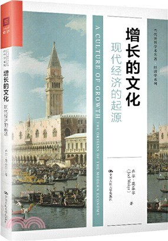

##  书名

《增长的文化：现代经济的起源》

英文原名：《A Culture of Growth: The Origins of the Modern Economy》

## 封面

## 内容简介

在18世纪晚期，欧洲创新引发的工业革命是世界经济发展的分水岭。为什么革命出现在了西方而非别处？为什么它可以持续发展，造就了从没有的经济繁荣？

在这部开创性的著作中，著名的经济史学家乔尔·莫基尔给出了答案：早期现代欧洲独具的一种增长的文化以及欧洲启蒙运动为科学进步和突破性的发明奠定了基础，而这正是引起这场爆发性技术和经济发展的原因。这并非任何欧洲文化优越性的结果，而是身处历史舞台中心的人们的信仰、价值观以及偏好的彻底转变，即“文化”改变，驱使了创新方法的产生。

将经济学、科学技术史和文化进化学结合在一起，《增长的文化：现代经济的起源/当代世界学术名著·经济学系列》为我们解释了为何在工业革命前的两个世纪，“早期现代”欧洲为我们的现代经济奠定了基础。

## 作者简介

乔尔‧莫基尔（Joel Mokyr），西北大学罗伯特 H.斯托茨人文科学教授和经济学与历史学教授，特拉维夫大学埃坦·柏格拉斯经济学院教授，曾任美国经济史协会会长。他的研究获得诸多奖项，是美国经济学联合会杰出会士奖、荷兰皇家科学院的海尼根历史学奖和国际巴尔扎恩经济史奖得主。

## 推荐理由

以开源软件为例的增长模式，让建立隔离理论的人非常的费解，但是转换一下角度，从更为宽广的历史视角来看，开源作为知识，本身就是隔离，增长是符合所有的规律的，否则也早就被历史淘汰了。

## 推荐人

[适兕](https://opensourceway.community/all_about_kuosi)，作者，「开源之道」主创。「OSCAR·开源之书·共读」发起者和记录者。