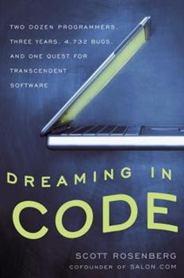

##  书名

《梦断代码》

英文原名：《Dreaming in Code: Two Dozen Programmers, Three Years, 4,732 Bugs, and One Quest for Transcendent Software》

## 封面

## 内容简介

一次伟大的征程, 就象 小米 由一锅小米粥开始

Chandler 项目以一群最强人才开始

力图解决信息孤岛问题

结果, 却不象 小米 手机征服世界

而是华丽的失败了; 为什么?

## 作者简介

斯科特·罗森伯格，Scott 是 Axios 的技术总编辑。他负责监督硅谷和华盛顿特区对科技公司、产品和政策的新闻的报道。

## 推荐理由

在技术领域, 成功各有各的成功, 无法复制,

失败却都失败在相同环节中,

有关开源的研究/图书/论文/故事/...

多数是讲成功,

这可能是头一本, 认真阐述失败的图书,

当年看得泪流满面,

14年后, 依然...

凡是想立即改变世界的好人们, 都应该看看这书:

- 项目成功太难, 失败却很容易, 为什么?
- 团队中强者太多, 不一定是好事儿, 为什么?
- 问题和功能如果不匹配一定失败, 为什么?
- ...

## 推荐人

大妈/[Zoom.Quiet](https://github.com/ZoomQuiet) : 活跃读者~~作者译者~~ ~专注吐糟37+年...