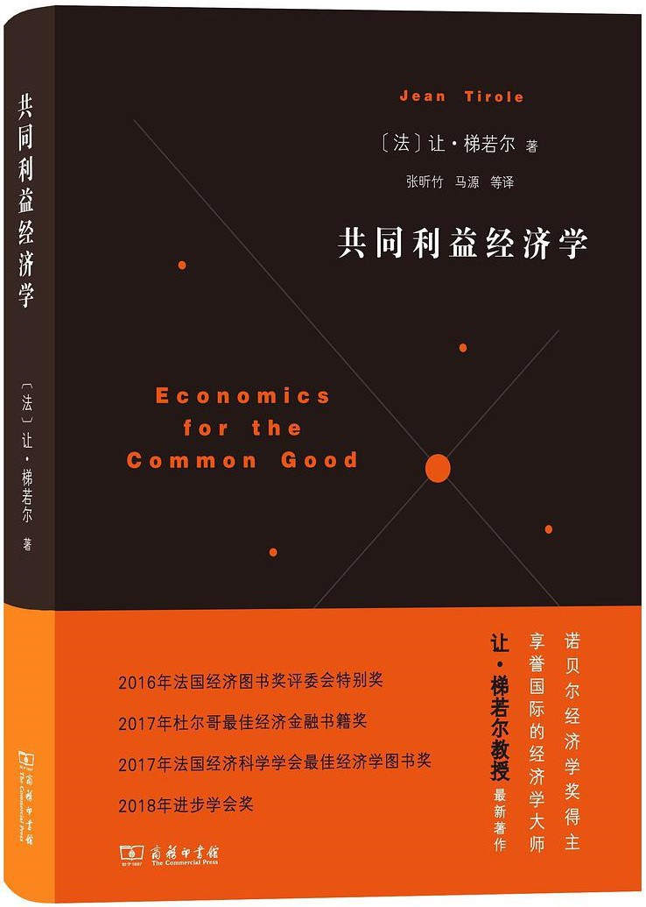

##  书名

《共同利益经济学》

英文原名：《Economics for the Common Good》

## 封面

## 内容简介

《共同利益经济学》是诺贝尔经济学奖得主、享誉国际的经济学大师让·梯若尔教授的最新著作。该书分为经济学与社会、经济学家职业、经济制度框架、巨大的宏观经济挑战、产业挑战等五部分，回应时代关切议题，力倡经济学社会责任，旨在促进人类共同利益。

## 作者简介

让·梯若尔（Jean Tirole）教授是法国让-雅克·拉丰基金会/图卢兹经济学院（TSE）董事会名誉主席、图卢兹高等研究院（IAST）主席、产业经济研究所（IDEI）科研主任、法国社会科学高等研究院（EHESS）联合研究主任、法兰西学院（Institut de France）院士、美国麻省理工学院（MIT）访问教授等。梯若尔教授的研究范围涵盖产业组织、监管、金融、宏观经济和银行业，以及心理经济学等诸多领域。他在国际学术期刊上发表了200多篇高水平论文，出版了12部学术专著，荣获了多个国际奖项，包括2007年法国国家科学研究中心（CNRS）金奖和2014年诺贝尔经济学奖。

## 推荐理由

开源项目是一种联合财产，属于共同利益的新形式，想一下为什么随时可以fork的项目，最后大家还是合理前行的终极原理吧。过分的贪婪造就的社会问题实在太多了，不应该在软件工业中出现。

## 推荐人

[适兕](https://opensourceway.community/all_about_kuosi)，作者，「开源之道」主创。「OSCAR·开源之书·共读」发起者和记录者。