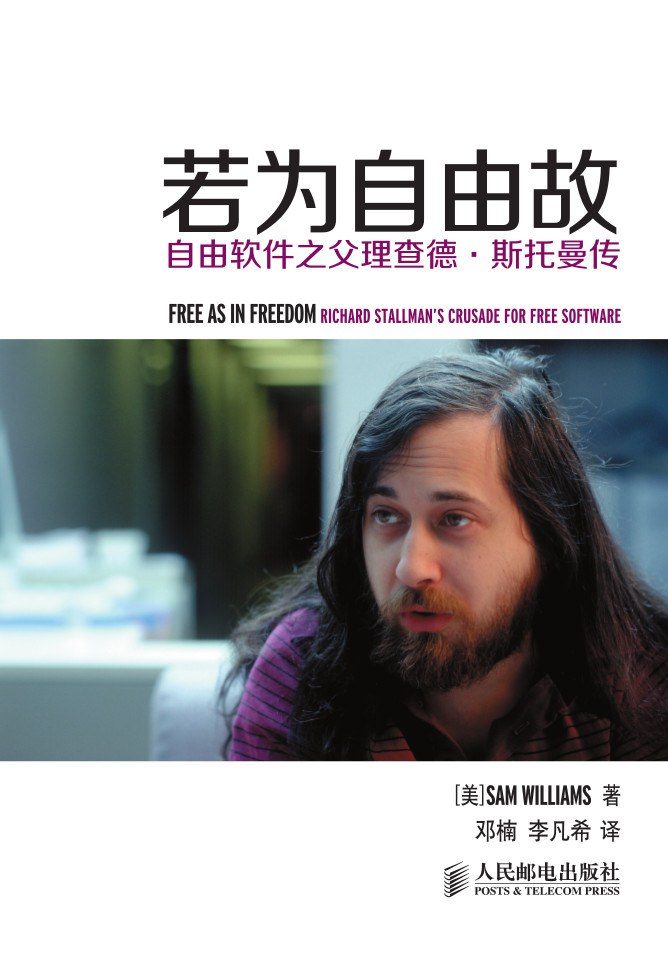

##  书名

《若为自由故:自由软件之父理查德·斯托曼传》

英文原名：《Free as in Freedom: Richard Stallman's Crusade for Free Software》

## 封面

## 内容简介

理查德·马修·斯托曼（Richard Matthew Stallman，简称RMS）是自由软件之父，他是自由软件运动的精神领袖、GNU计划以及自由软件基金会的创立者。作为一个著名的黑客，他的主要成就包括Emacs及后来的GNU Emacs、GNU C 编译器及GDB 调试器。他编写的GNU通用公共许可证（GNU GPL）是世上最广为采用的自由软件许可证，为copyleft观念开拓出一条崭新的道路。

本书用叙事体的风格，讲述了理查德·斯托曼的成长经历和传奇人生。本书记录了斯托曼从一名黑客成为自由软件的倡导者，并发起自由软件运动的成长经历。作者通过接触斯托曼本人、他的家庭、追随他的程序高手以及IT产业界，以全新的视角和丰富的笔触，塑造了这位软件产业界的“罗宾汉”的形象；由此也帮助读者了解他所倡导的自由软件运动的缘起、理念和发展历史。

## 作者简介

Sam Williams：美国纽约的一位自由作家。他主要关注高科技文化，特别是软件开发文化，以及很多的Web站点。从1988年到2001年，他为Upside Today撰写一个关于开源软件社区的专栏，他还为BeOpen.com网站进行过访谈。本书是他写的第二本书。

## 推荐理由

传奇人物的经历，总是会令常人感到好奇，Richard Stallman 为何会做出如此改变历史的事情？背后的驱动力是什么？理解自由、黑客文化，不去了解Richard Stallman，就会有所缺失。

## 推荐人

[适兕](https://opensourceway.community/all_about_kuosi)，作者，「开源之道」主创。「OSCAR·开源之书·共读」发起者和记录者。