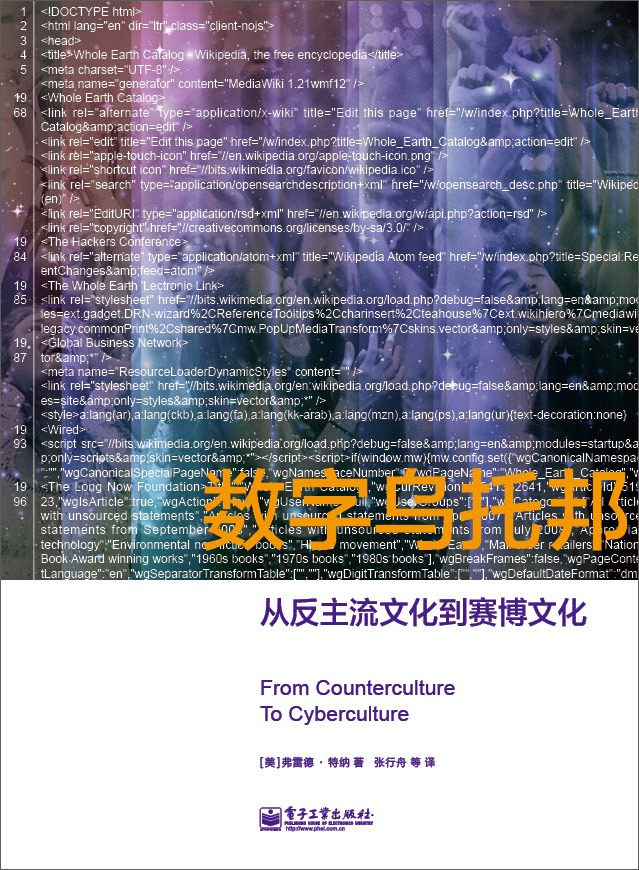

##  书名

《数字乌托邦：从反主流文化到赛博文化》

英文原名：《From Counterculture to Cyberculture：Stewart Brand, the Whole Earth Network, and the Rise of Digital Utopianism》

## 封面

## 内容简介

本书正是探索这次非同寻常，且颇具讽刺意味的变革的第一本书。作者挖掘出那些在旧金山湾区的先驱者——斯图尔特·布兰德和他的“全球网络”鲜为人知的故事。1968年到1998年期间，通过《全球概览》、“全球电子链接（WELL）”和最终取得巨大成功的《连线》杂志，布兰德和他的伙伴们长期扮演着旧金山嬉皮士运动和新兴科技聚集区硅谷的中间人的角色。正由于他们富有远见的努力，反主流文化分子和科技人士一同重新定义了计算机的形象：计算机是解放自我的武器，计算机建筑了令人耳目一新的虚拟社区，计算机还让人们能更大胆地拓展社会的新疆界。

## 作者简介

弗雷德·特纳（Fred Turner），美国斯坦福大学传播系副教授，斯坦福大学“科学、技术和社会”项目总监。弗雷德还具有十年的新闻记者经验。著有《数字乌托邦：从反主流文化到赛博文化》和《战争回响：美国的越战记忆》。

## 推荐理由

我们再怎么强调文化对于技术发展的重要性都不为过，如果你还心存怀疑的话，那么这本书会很好的告诉你：个人计算机、自由软件运动等背后的文化驱动力。

## 推荐人

[适兕](https://opensourceway.community/all_about_kuosi)，作者，「开源之道」主创。「OSCAR·开源之书·共读」发起者和记录者。