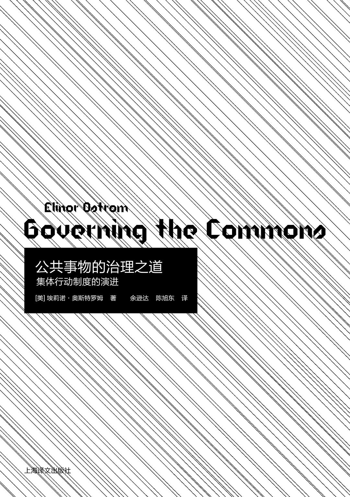

##  书名

《公共事物的治理之道：集体行动制度的演进》

英文原名：《Governing the Commons: The Evolution of Institutions for Collective Action》

## 封面

## 内容简介

为什么瑞士和日本的山林公地能维持几个世纪的经济增长和生态稳定，而土耳其的近海渔场却屡屡因过度捕捞而发生冲突？

为什么菲律宾桑赫拉的农民能建立起长期有效的公共灌溉系统，而美国加州政府却迟迟无法解决地下水的过度使用问题？

面对哈丁的“公地悲剧”，一些人建议由“国家”对绝大多数自然资源实行控制，以防止它们的毁灭；另一些人则建议把这些自然资源私有化就能解决问题。但我们在现实世界中看到的是：无论国家还是市场，都未能成功地解决“公地悲剧”；反而是许多地方和社群中的人们，借助既不同于国家也不同于市场的制度安排，对某些资源系统成功地实行了适度治理。

那么，对于一个地方和社群中互相依赖的公民而言，如何才能实现真正有效的自我组织和治理，从而在所有人都面对搭便车、规避责任或其他机会主义行为诱惑的情况下，取得持久的共同收益？

对此，本书通过对各种成败案例的实证考察，首次系统地总结了人们用以分析公共事物解决之道的理论模型，并从博弈的角度探索了政府与市场之外的自主治理公共资源的可能。

## 作者简介

埃莉诺·奥斯特罗姆（Elinor Ostrom），公共经济学研究和公共选择学派的创始人之一，美国印第安纳大学政治学教授，美国国家科学院院士和美国艺术与科学院院士，曾经担任过美国政治学协会主席、美国公共选择学会主席、公有产权研究协会主席等学术职务。1997年获得弗兰克·塞德曼政治经济学大奖，2009年获得诺贝尔经济学奖，亦是历史上第一个获得该奖项的女性。

## 推荐理由

大自然下的资源作为公共事务的时候，需要各种制度来获得可持续发展，开源软件作为人类自身的公共事物，该如何发展？二者之间尽管差异很大，但是相同的地方也很多！有很多地方可以借鉴与参考。

## 推荐人

[适兕](https://opensourceway.community/all_about_kuosi)，作者，「开源之道」主创。「OSCAR·开源之书·共读」发起者和记录者。