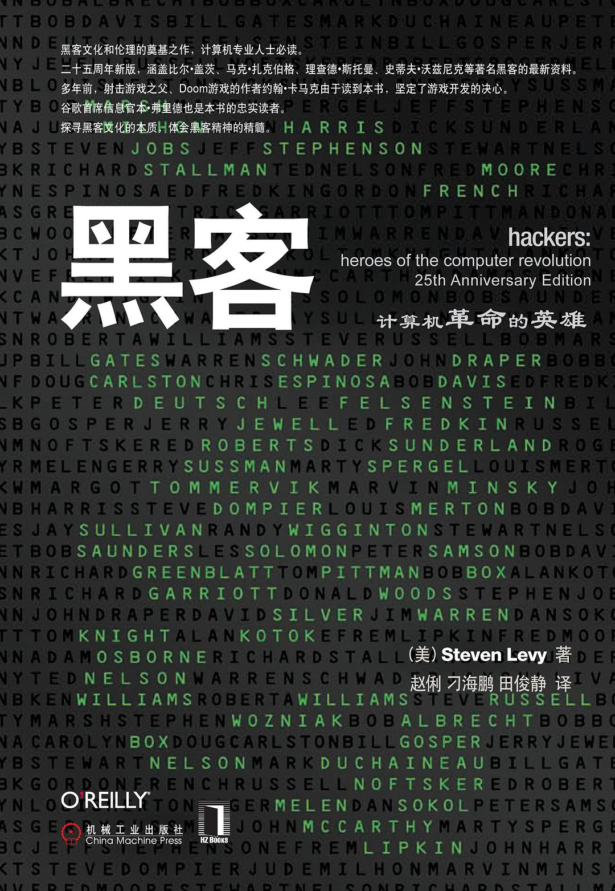

##  书名

《黑客：计算机革命的英雄》

英文原名：《Hackers: Heroes of the Computer Revolution》

## 封面

## 内容简介

从20世纪50年代早期跨越到80年代后期，追述了计算机革命中初期黑客的丰功伟绩，他们都是最聪明和最富有个性的精英。他们勇于承担风险，勇于挑战规则，并把世界推向了一个全新的发展方向。本书更新了一些著名黑客的最新资料，包括比尔·盖茨、马克·扎克伯格、理查德·斯托曼和史蒂夫·沃兹尼亚克，并讲述了从早期计算机研究实验室到最初的家用计算机期间一些妙趣横生的故事。

在Levy的笔下，他们都是聪明而勤奋的人，他们极富想象力，他们另辟蹊径，发现了计算机工程问题的巧妙解决方案。他们都有一个共同的价值观，那就是至今仍然长盛不衰的“黑客道德”。本书描述了近代历史上的一个萌芽时期，描述了黑客用默默无闻的行动为当今的数字世界照亮了一条道路，描述了那些打破陈规“非法”访问穿孔卡片计算机的MIT的学生，也描述了缔造出Altair和Apple II电脑这些伟大产品的DIY文化。

## 作者简介

Steven Levy，《连线》杂志的特约撰稿人和资深作者。以前是《新闻周刊》（Newsweek）的首席技术作者和高级编辑。被誉为“数字时代最顶尖的史学家”之一。

## 推荐理由

如果你惊叹于开源的成就，想从决定论的角度去探究它的话，那么这本书会告诉你所有的答案。

## 推荐人

[适兕](https://opensourceway.community/all_about_kuosi)，作者，「开源之道」主创。「OSCAR·开源之书·共读」发起者和记录者。