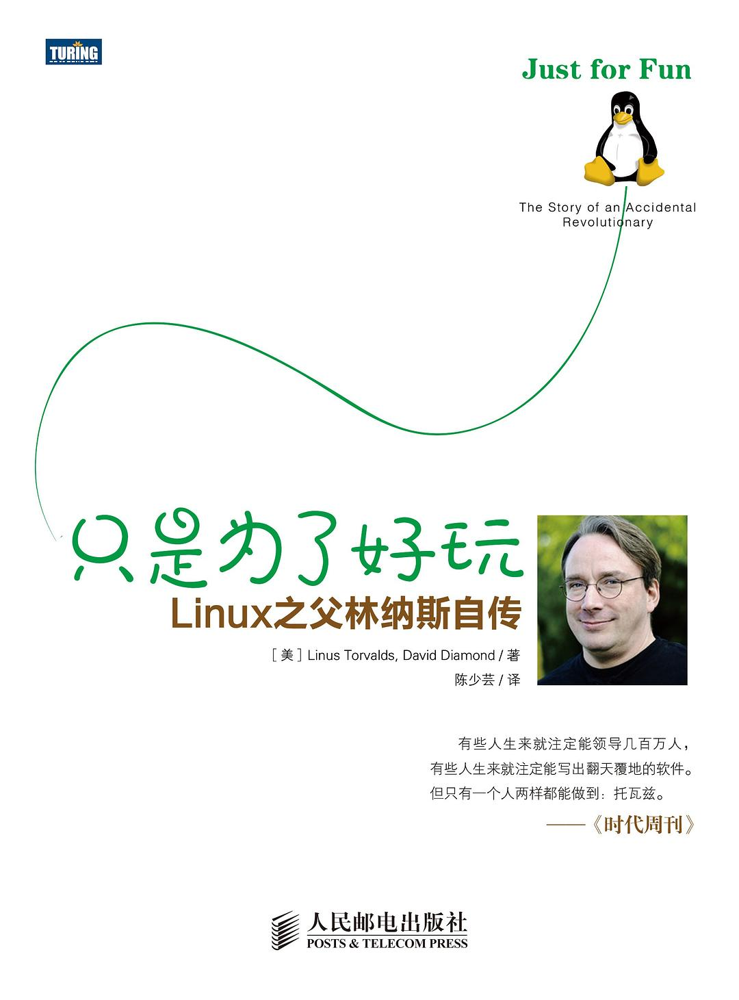

##  书名

《只是为了好玩:Linux之父林纳斯自传》

英文原名：《Just for Fun: The Story of an Accidental Revolutionary》

## 封面

## 内容简介

本书是Linux之父Linus Torvalds的自传。

Linux之父Linus Torvalds的自传，也是Linus唯一一本书。Linus以调侃的语气讲述了自己的成长经历，在他看来，一切都是为了好玩儿，兴趣引发革命。书中内容共分为五章，一部分是Linus自己写的，一部分是合著者David Diamond的评论。

## 作者简介

林纳斯•托瓦兹 当今世界最著名的程序员、黑客，开源操作系统Linux之父。生于芬兰，毕业于赫尔辛基大学，1997年～2003年任职于美国加州硅谷的全美达公司，现受聘于开放源代码开发实验室，全力开发Linux内核。2004年，他被《时代周刊》评为世界最有影响力的人之一。

大卫•戴蒙 职业撰稿人，曾为《纽约时报》《连线》《美国周末》及许多刊物供稿。

## 推荐理由

传记类作品，给我们以启迪，人生只有一次，做点好玩的事情，没有谁比Linus更为潇洒自如的了，但是，细心的读者仍然能看出美国文化对匠人的保护和维系，读此书，了解资本、社会、个体、表达等背后的庞大机理。

 -- By <a href="https://opensourceway.community/">适兕</a>  作者,「开源之道」主创，「OSCAR·开源之书·共读」发起者和记录者

在计算机的世界里，我内心里一直对于Linux 的神话羡慕不已。一个人、一个芬兰高中生、一个暑假、开发出来一个操作系统。Linus以一己之力书写了计算机发展史上的传奇。Linux 你可以任意使用它、任意安装它、它上面数不清的工具以及其中包含的深刻的设计思想深深的影响了一代又一代黑客，成为英雄的传说。读本书，了解英雄的成长故事，找到人生的意义。

-- By 武晓慧 Redhat工程师
