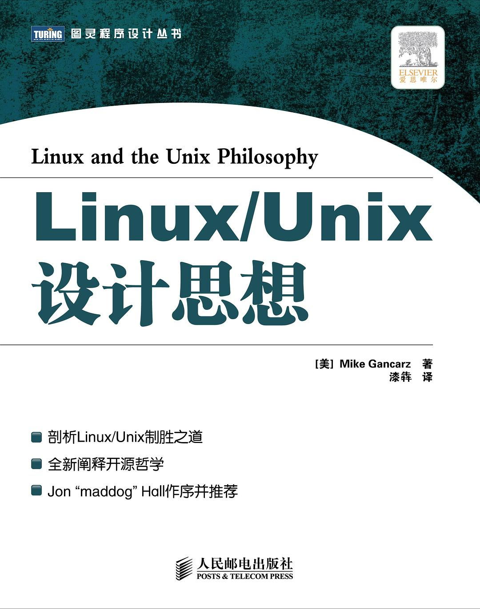

##  书名

《Linux/Unix设计思想》

英文原名：《Linux and the Unix Philosophy》

## 封面

## 内容简介

将Linux的开发方式与Unix的原理有效地结合起来，总结出Linux与Unix软件开发中的设计原则。《Linux\Unix设计思想/图灵程序设计丛书》前8章分别介绍了Linux与Unix中9条基本的哲学准则和10条次要准则。第9章和第10章将Unix系统的设计思想与其他系统的设计思想进行了对比。最后介绍了Unix哲学准则在其他领域中的应用。

## 作者简介

Mike Gancarz 是佐治亚州亚特兰大的一名编程顾问。作为 Unix 应用程序设计方面的专家，Mike 二十多年来一直是 Unix 方法的倡导者。作为 X Window System 诞生团队的一员，他开创了可用性概念，这些概念仍然存在于今天在 Linux 上运行的现代窗口管理器中。在位于新罕布什尔州纳舒厄的 Digital Equipment Corporation 的 Unix Engineering Group 工作期间，Mike 将 Unix 命令和实用程序移植到 64 位 Alpha 处理器。他的第一本书《Unix 哲学》（数字出版社，1995 年）已在全球售出超过 15,000 册。

## 推荐理由

Linux 是开源的终极应用不是没有道理的，看看它的设计思想就明白这一切并非是运气，而是实力担当。

## 推荐人

[适兕](https://opensourceway.community/all_about_kuosi)，作者，「开源之道」主创。「OSCAR·开源之书·共读」发起者和记录者。