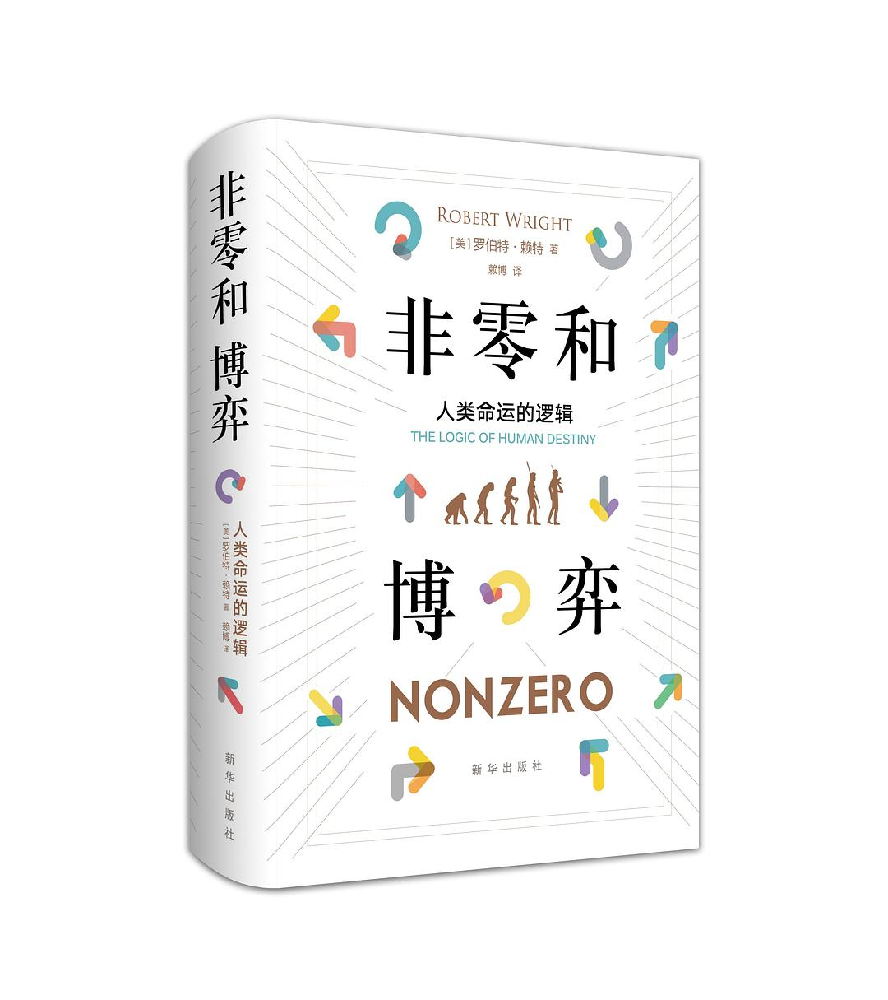

##  书名

《非零和博弈——人类命运的逻辑》

英文原名：《Nonzero: The Logic of Human Destiny》

## 封面

## 内容简介

本书将生物进化和人类的文化演进进行比较，从细菌的化石一路叙述到石器时代的石斧，从中世纪的商业模式一路叙述到世界贸易组织，探寻不同文化共有的发展轨迹和模式，生物演进导致人类的产生、人类组织的演进导致了文化的产生、文化的演进使地球形成一个统一的大脑。运用博弈论的观点，揭示人类历史的必然命运：世界和人类发展的推动力和最终趋向并不是你死我活的竞争关系，而是互利共赢的合作关系，即“非零和”，进而为全球化发展指明了方向。本书用搏弈论的方法解释生物进化论，并进而应用进化理论解释文化与历史的演化的作品。对于人类文化的演进的结论（走向非零和时代），对读者了解全球化下的世界具有指导作用，是近年来最为热议的书籍之一。

## 作者简介

[美]罗伯特•赖特，美国前总统克林顿智囊，全球百位最具影响力思想家之一。《新共和》高级编辑，《大西洋月刊》《纽约客》《时代》等杂志的撰稿人，曾供职于《科学》杂志。他关于科学、技术和哲学的文章曾获国家期刊奖。他的著作《三个科学家及其上帝：寻找信息时代的意义》曾获美国国家图书奖提名。

## 推荐理由

Linux 基金会执行总监Jim Zemlin 说：**“开源不是一个零和游戏：你可以在帮助别人的同时帮助自己”**。 如果看不清开源的逻辑的话，可以跳出来看人类的命运。

## 推荐人

[适兕](https://opensourceway.community/all_about_kuosi)，作者，「开源之道」主创。「OSCAR·开源之书·共读」发起者和记录者。