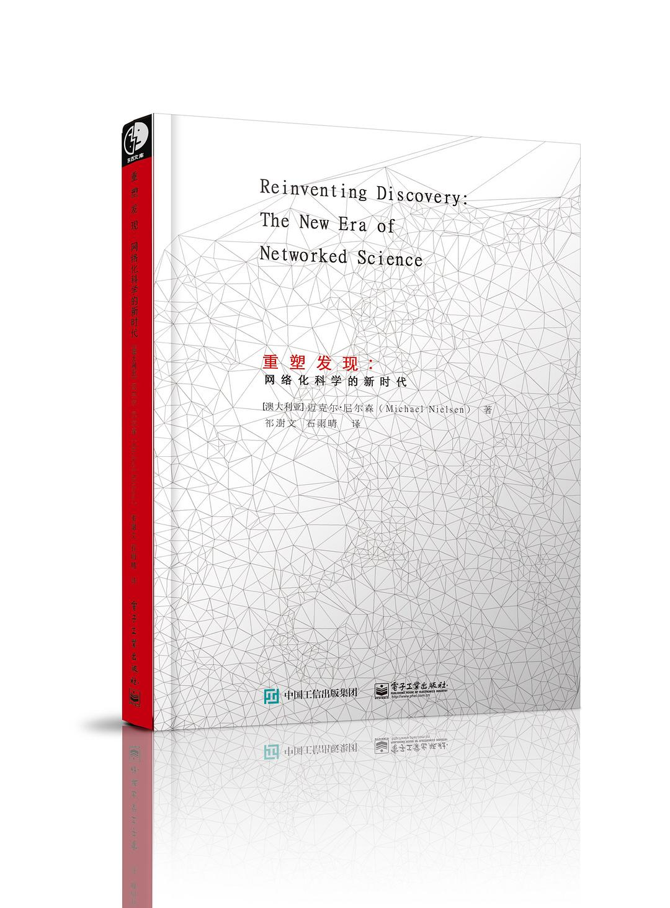

##  书名

《重塑发现：网络化科学的新时代》

英文原名：《Reinventing Discovery：The New Era of Networked Science》

## 封面

## 内容简介

作者迈克尔•尼尔森认为，我们正生活在这样一个阶段的曙光中：在这个阶段未来的三百年间，科学领域将经历它有史以来最剧烈的变动！强大的新认知工具和互联网，大大加快了科学发现的速度。《重塑发现》（Reinventing Discovery）这本书讲述了联网时代有关新科学的精彩故事。

## 作者简介

迈克尔•尼尔森（Michael Nielsen），澳大利亚量子计算科学家。研究领域从量子计算、开放科学到人工神经网络和深度学习。曾供职于洛斯阿拉莫斯国家实验室（Los Alamos National Laboratory，LANL；前称Y计划，是美国承担核子武器设计工作的两个实验室之一），2004年被授予澳大利亚“Youngest Academic”称号，并获昆士兰大学联邦基金。作者的TED演讲视频：http://www.ted.com/talks/michael_nielsen_open_science_now.html

## 推荐理由

开源的精神和伦理继承自开学，但是开源也反过来影响和改变着科学的进程，例如集体智慧和开放性，开源方式的协作是从科学诞生以来的终极梦想。

## 推荐人

[适兕](https://opensourceway.community/all_about_kuosi)，作者，「开源之道」主创。「OSCAR·开源之书·共读」发起者和记录者。