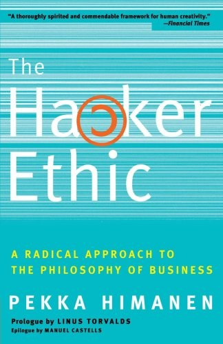

##  书名

《黑客伦理与信息时代精神》

英文原名：《The Hacker Ethic and the Spirit of the Information Age》

## 封面

## 内容简介

大约一个世纪前，马克斯·韦伯的《新教伦理与资本主义精神》揭示了工业时代的精神——新教伦理。现在，另一个芬兰人派卡·海曼，与李纳斯·托沃兹（Linux操作系统的创始人）和曼纽尔·卡斯特斯（《信息时代》作者）一起，阐述了黑客如何代表信息时代一种全新的与新教伦理相对的精神气质，它倡导工作的娱乐性和艺术性，这不仅意味旧工业时代精神的反叛，还意味着对当今社会和我们生活的各个方面的挑战。 没有黑客，电子邮件、因特网和万维网便不可能得到普及。黑客伦理是基于娱乐、激情、共享和创造价值的思维方式和哲学，具有提升个人、公司竞争力的巨大潜力。对企业来说，现在比以往任何时候都更需要灵活多变，在这一点上，黑客无疑是当今之世最重的的革新者。 在日益技术化的社会里，充满了创造精神和挑战传统的黑客价值倡导充满激情和自由节奏的工作；信仰个人能以不可思议的方式创造伟大奇迹；渴求捍卫我们既有的伦理理想，如隐私和平等。《黑客伦理》将带领我们进行一次精彩纷呈的旅行，让我们以全新的角度审视我们的生活和工作方式。

## 作者简介

派卡・海曼（Pekka Himanen）：一个技术神童，20岁在芬兰赫尔辛基大学获得哲学博士学位。他正在从事技术发展社会意义的研究，这使他与学术界、艺术界、政府部门以及公司CEO建立广泛对话。他目前在赫尔辛基大学和美国加利福尼亚大学伯克利分校工作。

李纳斯・托沃兹（Linus Torvalds）：计算机行业内最受尊敬的黑客之一。他1991年还是芬兰赫尔辛基大学的一名学生时，创达了Linux操作系统。此后，Linux发展成为世界上成千上万的程序员和数目万用户参与的工程。

曼纽尔・卡斯特斯（Manuel Castells）：美国加利福尼亚大学伯克利分校社会学教授、他出版了获得广泛承认的《信息时代》（The Information Age）和城市与草根》（The City and Grassroots）（ 1983年获C.wright Mills奖）等二十多本著作。

## 推荐理由

数字化时代，懂编码的人将会获得相当大的权力，法律具有滞后性，这个中间的空间唯有伦理能够约束权力的无限扩张，这也是缓和社会冲突的重要地带，当然最重要的是人获得幸福与尊严的方式，更是社会不断发展的重要动力 —— 因为伦理会成为文化沉淀下来。

## 推荐人

[适兕](https://opensourceway.community/all_about_kuosi)，作者，「开源之道」主创。「OSCAR·开源之书·共读」发起者和记录者。