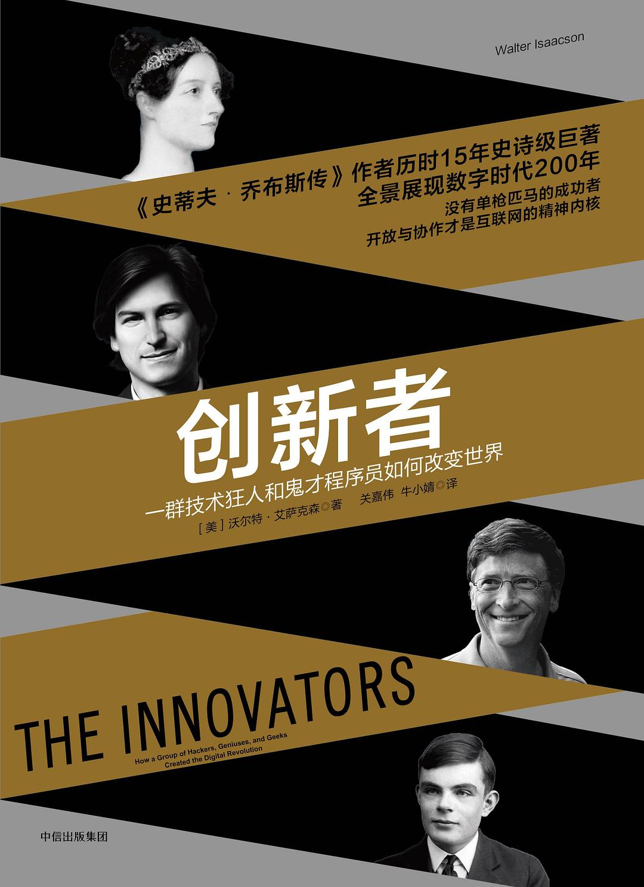

##  书名

《创新者：一群技术狂人和鬼才程序员如何改变世界》

英文原名：《The Innovators：How a Group of Hackers, Geniuses, and Geeks Created the Digital Revolution》

## 封面

## 内容简介

在近200年的数字化进程中群星闪耀，艾萨克森从第一个计算机程序的创造者、浪漫主义诗人拜伦之女埃达•洛夫莱斯伯爵夫人说起，细数了这一群将科学与人文融合的创新者，他们包括第一台通用型的电子计算机的创造者莫奇利、科学家冯·诺依曼、仙童半导体公司的“八叛逆”、天才图灵、英特尔的格鲁夫、微软的比尔·盖茨、苹果公司的乔布斯、谷歌的拉里·佩奇等。这些拥有不羁创意的先锋者、黑客、天才、企业家们，并不是孤立的存在，他们秉承着开放与共享的精神，通过跨越世代的合作，让科技实现了创造性的飞跃，而他们沉淀下来的社会和文化力量成为了滋养创新的坚实土壤。

## 作者简介

沃尔特·艾萨克森毕业于哈佛大学，现为阿斯彭研究所（Aspen Institute）首席执行官，曾任美国有线电视新闻网（CNN）董事长及《时代》周刊总编。他的主要作品有《史蒂夫·乔布斯传》、《爱因斯坦传》、《本杰明·富兰克林传》、《创造者》等。艾萨克森现居华盛顿。

## 推荐理由

对自由和开源软件在历史上的客观定位，从开源世界的拥护者和反对者之外的第三者的维度来看开源对于整个信息技术的贡献，这是消除偏见的重要著作。

## 推荐人

[适兕](https://opensourceway.community/all_about_kuosi)，作者，「开源之道」主创。「OSCAR·开源之书·共读」发起者和记录者。
