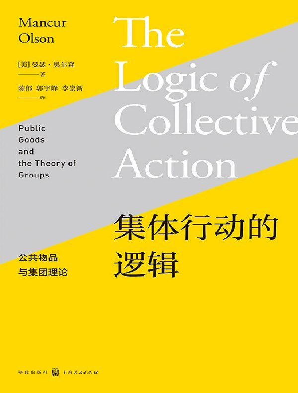

##  书名

《集体行动的逻辑：公共物品与集团理论》

英文原名：《The Logic of Collective Action: Public Goods and the Theory of Groups》

## 封面

## 内容简介

奥尔森教授撰写的这本《集体行动的逻辑》一书是公共选择理论的奠基之作。第1章对集团和组织行为的某些方面作了逻辑的理论的解释。第2章考察了对不同规模的集团进行分析的含义，并得出在许多情况下小集团更有效率、更富有生命力这一结论。第3章考察了赞成工会的论点的含义，并得出以下结论：某一形式的强制性会员制度在大多数情况下对工会是生死攸关的。第4章运用本研究中提出的方法对马克思的社会阶级理论进行考察并对其他一些经济学家提出的国家理论进行分析。第5章按照本研究阐述的逻辑对许多政治学家使用的“集团理论”进行分析，并证明对这一理论的通常理解在逻辑上是矛盾的。最后一章提出了一个与第1章概述的逻辑关系相一致的新的压力集团理论。这一理论说明大的压力集团组织的会员制度和力量并不是游说疏通活动的结果，而是它们其他活动的副产品。

## 作者简介

曼瑟·奥尔森（Mancur Olson），当代最有影响力的经济学家之一，美国马里兰大学经济学教授，公共选择理论的主要奠基者。主要著作包括：《战时短缺经济学》（1963）、《集体行动的逻辑》（1965）、《一份准备中的社会报告》（1969）、《没有增长的社会》（1974）、《健康护理经济学新方法》（1982）、《国家的兴衰》（1982）和《权力与繁荣》（2000）。奥尔森的学术贡献远远超越经济学的范围，对政治学、社会学、管理学以及其他社会科学的发展都起了重大的作用。

## 推荐理由

思考开源为什么能够成功固然重要，观察和学习认为开源不可能的思想也非常的重要，《集体行动的逻辑》就告诉我们，相容性集团即所有人参与将蛋糕做大的集团即使存在，也要看个体和集体的利益是否一致，这两个问题叠加起来，足够让我们去理解和消化的了。这本书对于理解开源集团（共同体、基金会、社团等）在中国能否建立起来至关重要。

## 推荐人

[适兕](https://opensourceway.community/all_about_kuosi)，作者，「开源之道」主创。「OSCAR·开源之书·共读」发起者和记录者。