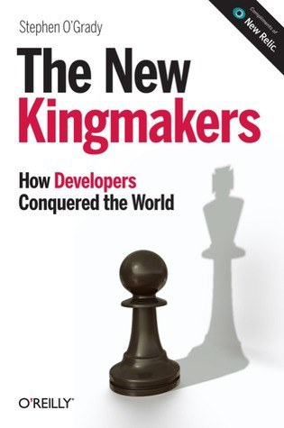

##  书名

《开发者是如何征服世界的》

英文原名：《The New Kingmakers:How Developers Conquered the World》

## 封面

## 内容简介

作者以分析师的独特视角，纵横捭阖的点明了我们现在赖与生存的世界，商业的催化剂和动力所在—— 开发者的崛起！独立的个体伴随着云计算、互联网、开源思想/文化的成熟而可以进行自由、独立的想象，于是，世界被这些工程师所塑造，创造出更多美好，也有很多可以被商业所推动的内容。

## 作者简介

Stephen O’Grady 是知名专注于开发者行业的分析公司RedMonk 的联合创始人，在RedMonk， Stephen 和诸如 IBM、DELL、VMWare、RedHat 等IT公司合作解决各种问题。有超过十多年的丰富经验，文章经常被各大财经媒体引用，如纽约时报、NPR、波士顿全球、华尔街日报等，他也是各种会议的主持人和受欢迎的演讲者。

## 推荐理由

想要知道为何开源在过去的几十年逐渐的受到重视的深层次原因，这本书会告诉你：开发者的自动选择：开发者才是开源决胜天下的重要力量，换句话说：开源是开发者用脚投票的结果。

## 推荐人

[适兕](https://opensourceway.community/all_about_kuosi)，作者，「开源之道」主创。「OSCAR·开源之书·共读」发起者和记录者。