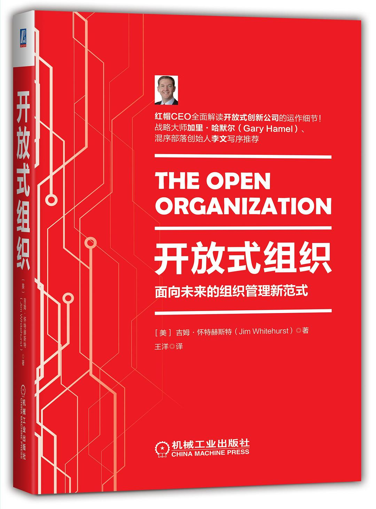

## 书名

《开放式组织：面向未来的组织管理新范式》

英文原名：《The Open Organization: Igniting Passion and Performance》

## 封面

## 内容简介

在《开放式组织》中，开放源代码的巨人——红帽公司的著名总裁和CEO吉姆•怀特赫斯特根据他在开源领域的亲身经历，绘出了一份领导力的蓝图。通过真实记录他从传统经理人转变为 “首席问题解决者”的过程，吉姆清晰地展示了如何让员工、合作伙伴和客户热情高涨地参与到社区当中，如何借此点燃大家的热情、鼓励创新，从而在真正的开放、合作和共同使命的基础上，将现代企业带向成功。

《开放式组织》写给大公司、小公司、成熟型公司、艰难成长的创业型公司的领导者和期待成为领导者的人们，展示如何打造一个新型的开放式组织模式，获得当今企业必须具备的速度和灵活性。

## 作者介绍

吉姆•怀特赫斯特（Jim Whitehurst），目前世界上最资深的开放源代码提供商美国红帽公司（两次登上《福布斯》杂志“全球最具创新力企业”榜单）（前）CEO。在加入红帽公司之前，怀特赫斯特曾在达美航空公司（Delta Air Lines）担任首席运营官等数个职务，主要负责运营、销售、客户服务、网络和营收管理、市场营销以及公司战略等事务。在加入达美航空公司之前，他曾任波士顿咨询公司（The Boston Consulting Group, BCG）合伙人，并在芝加哥、香港、上海和亚特兰大办公室担任多个领导职位。

## 推荐理由

人是自觉的、内驱的，由这样的人组成的团队，是很多人心目中的梦幻组合，然而，越是自驱力的团队，越是需要开放、透明、和参与，RedHat 做到了，我们也应该努力往这个方向靠近。

## 推荐人

[适兕](https://opensourceway.community/all_about_kuosi)，作者，「开源之道」主创。「OSCAR·开源之书·共读」发起者和记录者。