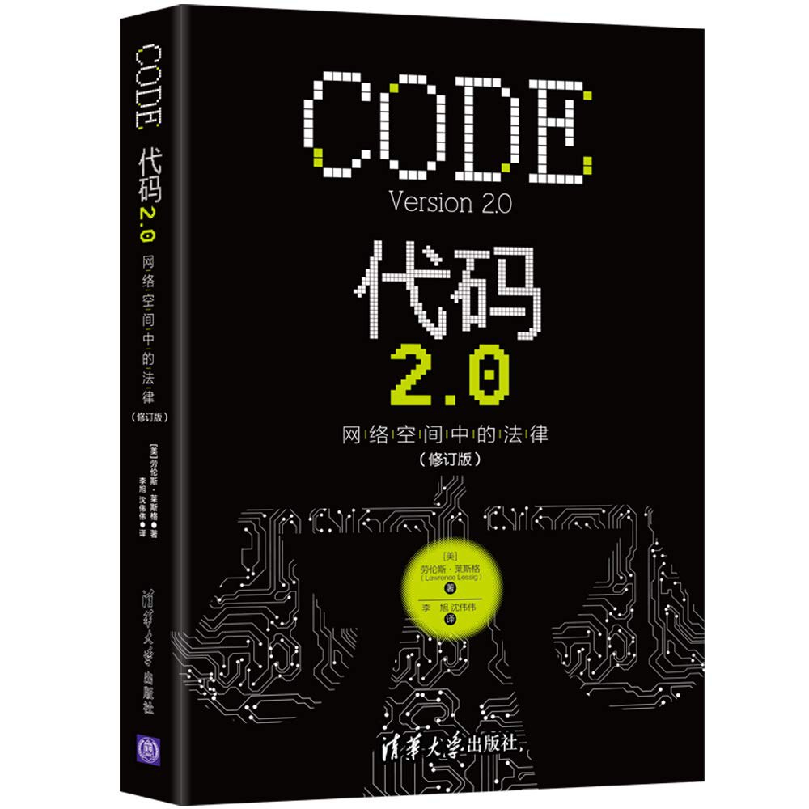

##  书名

《代码2.0:网络空间中的法律》

英文原名：《Code: And Other Laws of Cyberspace, Version 2.0》

## 封面

## 内容简介

我们对互联网未来所能做出的和正在作出的选择。代码即法律，空间代码、法律、共同体规范、市场四大约束！作为人本身，在众多力量所包围，可能在做出选择之前，更需要的做的是理解事物的本质：

* 控制源代码对于网民意味着什么？
* 法律是否能够在网络空间起作用？
* 市场更倾向于何方？

## 作者简介

劳伦斯·莱斯格，现任斯坦福大学法学院教授，是斯坦福大网络与社会研究中心创始人，全球是最负盛名的网络法律专家，被《商业周刊》称为“互联网时代的守护神”。

“网络法律界具原创思想的教授”、“对互联网最具影响的25人之一”，被《纽约客》称为“互联网时代最重要的知识产权思想家”。他几乎参与了所有重大论争：美国在线一时代华纳合并案、Napster音乐版权大虞、微软反垄断案、俄罗斯黑客事件、DVD破解案……他还对美国微软反垄断案审判结果产生了重要的影响。

## 推荐理由

代码即法律，在互联网的世界里，源代码的封闭会造成灾难，目前看起来，Lawrence Lessig的观点就像是预言，网民的权力并没有实现，而是被更多的力量所约束。

## 推荐人

[适兕](https://opensourceway.community/all_about_kuosi)，作者，「开源之道」主创。「OSCAR·开源之书·共读」发起者和记录者。