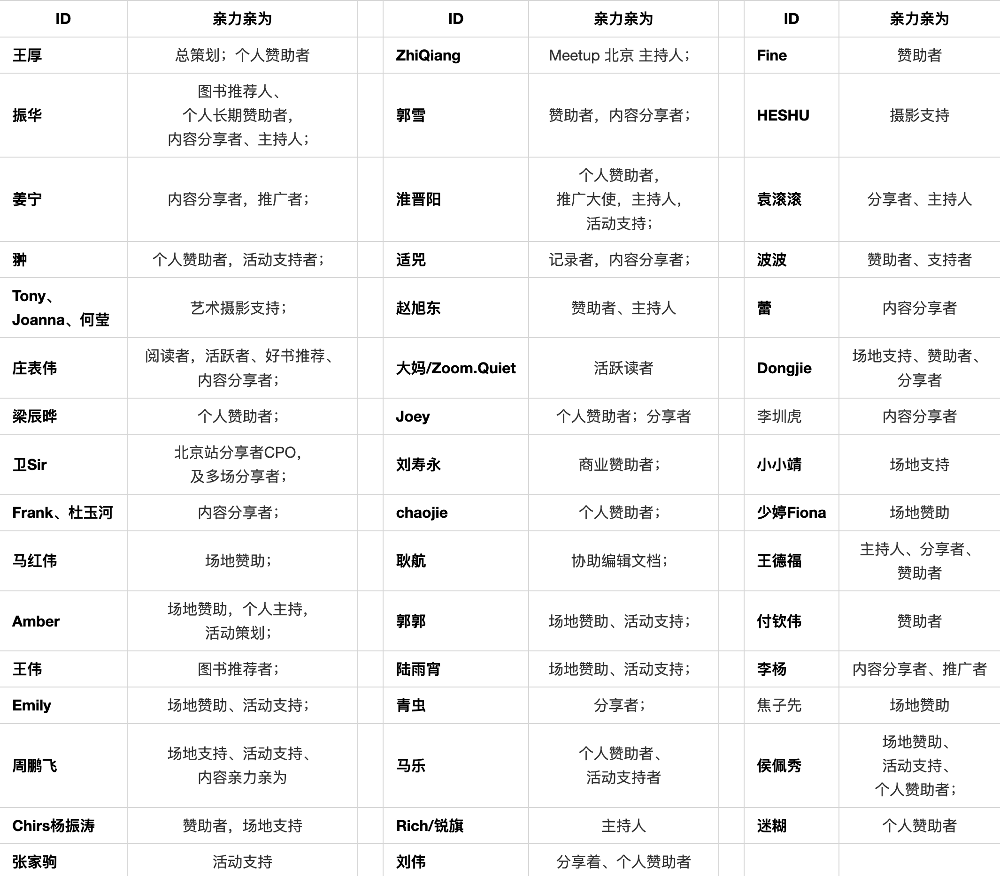

## 特别感谢长期以来的个人赞助者：

* 王厚
* 振华

## 「OSCAR·开源之书·共读」主要 Contributor 及事务 ：

## 特别感谢历次线下分享的场地赞助（时间顺序）：

* 10HUG
* 工业4.0俱乐部
* 中国信息通信研究院
* 太极集团
* EMQ 
* 中科创达
* 奇遇书店
* 思否
* 上海对外经贸大学
* 开放原子基金会
* 百度开源办公室
* 阿里巴巴开源办公室
* AWS 中国
* 第四范式
* 开源社
* 微软中国
* CSDN
* 字节跳动开源委员会
* OceanBase 公司
* Dev·Together大会（思否主办）
* vivo 互联网/OSPO
* RedHat 中国 融科+芳草地
* 薪享宏福
* 中关村创业大街
