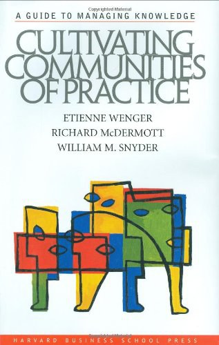

##  书名

《知识社群：将个体知识融汇成集体智慧》

英文原名：《Cultivating Communities of Practice: A Guide to Managing Knowledge》

## 封面

## 内容简介

当今的市场由知识推动。然而，如何系统地组织利用知识仍然是一项挑战。领先企业已经发现，光有技术是不够的，培养实践共同体才是有效知识战略的基石。实践共同体围绕着共同的兴趣和专长聚集在一起--无论是一线经理还是客户服务代表，无论是神经外科医生还是软件程序员，无论是城市管理者还是家庭装修爱好者。他们在团队、业务部门甚至整个公司内部和跨部门创造、共享和应用知识，为创建真正的知识型组织提供了具体途径。

在《知识社群：将个体知识融汇成集体智慧》一书中，埃蒂纳·温格、理查德·麦克德马和威廉姆M．施奈德认为，虽然共同体是自然形成的，但组织需要更加积极主动、更加系统地发展社群，并将其整合到组织战略中。本书提供了实用的模式和方法来管理这些共同体，使其充分发挥潜力--同时又不压制使其变得如此宝贵的内在动力。

## 作者简介

埃蒂纳·温格是一位独立咨询师。研究学者。作家和演讲者。他是“实践社团”研究的先锋，目前已经成为该领域内全球公认的思想领袖。他在理论方面做出了众多的成就，在实践中也帮助了许多企业培养实践社团。

理查德·麦克德马是麦克德马咨询公司的总裁，近20年来一直致力于设计实践社团。他积累了丰富的设计公司社团活动的经验，并亲自参与了多个实践社团的启动与运行。

威廉姆M．施奈德在组织发展领域已有将近20年的咨询经验，曾在麦肯锡公司从事战略性知识创造活动的研究，并与美国政府改革合作组一起，针对家庭卫生、公共安全和劳动力发展等社会问题发起了几个全国性的实践社团。

## 推荐理由

知识是散落于社会的各个角落的，这也是开源顺应了人类的社会这一特点，能够为我们所用，但是任何一个组织又是需要集中知识去做一些实际的事情的，尤其是现代企业，通过对教育的支持而获得知识和人力，但是这远远不够。在开源的世界里学习知识，毫无疑问，也需要使用开源世界的法则，任何一个组织都不能例外。

 -- By <a href="https://opensourceway.community/">适兕</a>  作者,「开源之道」主创，「OSCAR·开源之书·共读」发起者和记录者

