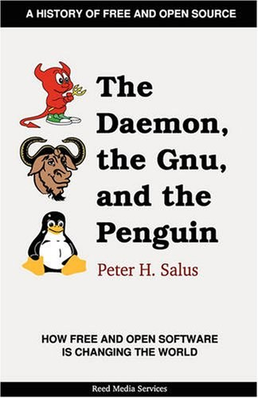

##  书名

《恶魔、角马与企鹅：自由和开放软件如何改变世界》

英文原名：《The Daemon, the Gnu, and the Penguin》

## 封面

## 内容简介

这是一部难得的讲述自由和开源早期历史的著作，尤其是Unix之前的故事，让大家深入了解计算机早期的开源萌芽和雏形。当然，以BSD为代表、GNU和Linux的不同发展路径，也是大家值得关注的。

## 作者简介

Peter Salus 博士是“A Quarter Century of UNIX”一书的作者，Salus 博士也曾担任 USENIX 协会的执行董事。

## 在线阅读

本书以公开连载的方式发布在著名网站groklaw上：

http://www.groklaw.net/staticpages/index.php?page=20051013231901859

## 推荐理由

随着开源逐渐的被主流所接受，不了解开源的历史而从事开源，或者和开源打交道，都是盲目而不负责任的，本书理应成为相关从业者的必读书籍。

## 推荐人

[适兕](https://opensourceway.community/all_about_kuosi)，作者，「开源之道」主创。「OSCAR·开源之书·共读」发起者和记录者。