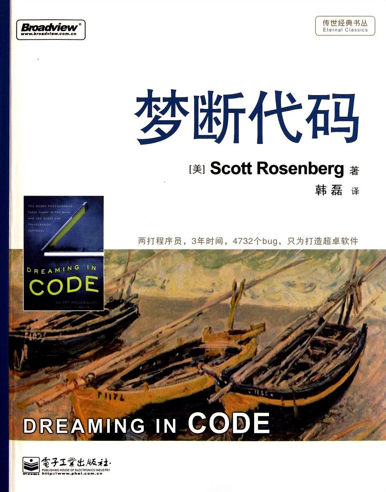

##  书名

《梦断代码》

英文原名：《Dreaming In Code》

## 封面

## 内容简介

软件乃是人类自以为最有把握，实则最难掌控的技术。《梦断代码》作者罗森伯格对OSAF主持的Chandler项目进行田野调查，跟踪经年，试图借由Chandler项目的开发过程揭示软件开发中的一些根本性大问题。

《梦断代码》是讲一事，也是讲百千事；是写一软件，也是写百千软件；是写一群人，也是写百千万人。任何一个在软件领域稍有经验的技术人员看完《梦断代码》，必掩卷长叹：做软件难。

## 作者简介

Scott Rosenberg：作家，编辑，1981年毕业于哈佛大学，1995年与他人共同创办了Salon网站，此后担任其首席技术编辑达数年之久，并负责技术工作。从1986到1995年，一直为San Francisco Examiner写作，最初写剧评，后来又写影评和“数字文化”专栏。所写的剧评曾于1989年获George Jean Nathan奖。在进入Examiner之前，一直为Boston Phoenix写剧评、影评和书评。个人博客地址为www.wordyard.com。

## 推荐理由

在技术领域, 成功各有各的成功, 无法复制,
失败却都失败在相同环节中,
有关开源的研究/图书/论文/故事/...
多数是讲成功,
这可能是头一本, 认真阐述失败的图书,
当年看得泪流满面,
14年后, 依然...
凡是想立即改变世界的好人们, 都应该看看这书:

* 项目成功太难, 失败却很容易, 为什么?
* 团队中强者太多, 不一定是好事儿, 为什么?
* 问题和功能如果不匹配一定失败, 为什么?
* ...

## 推荐人

大妈/Zoom.Quiet : 活跃读者作者译者~专注吐糟37+年...