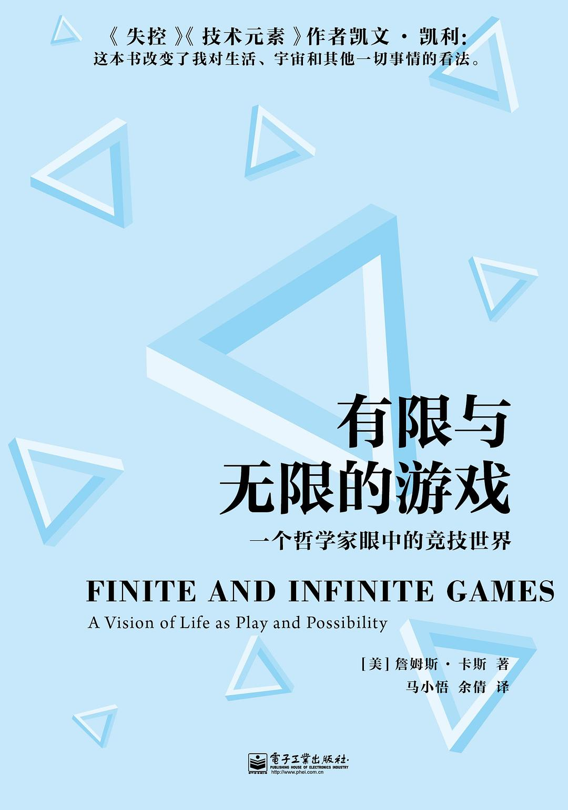

##  书名

《有限与无限的游戏:一个哲学家眼中的竞技世界》

英文原名：《Finite and Infinite Games: A Vision of Life as Play and Possibility》

## 封面

## 内容简介

在这本书中，詹姆斯·卡斯向我们展示了世界上两种类型的「游戏」：「有限的游戏」和「无限的游戏」。

有限的游戏，其目的在于赢得胜利；无限的游戏，却旨在让游戏永远进行下去。有限的游戏在边界内玩，无限的游戏玩的就是边界。有限的游戏具有一个确定的开始和结束，拥有特定的赢家，规则的存在就是为了保证游戏会结束。无限的游戏既没有确定的开始和结束，也没有赢家，它的目的在于将更多的人带入到游戏本身中来，从而延续游戏。

## 作者简介

詹姆斯·卡斯，纽约大学宗教历史系教授。 卡斯本人是一个无神论者，他把自己的信仰描述为「着迷于不可知的作为人类的存在」。机器、战争、时间、性、宗教、文学，通过把这些概念化的术语扩展到人类事务的多个领域，作者跨越了主观和客观领域的界线，在不同学术传统之间建立起可沟通的桥梁 。这本书以「玩家」的视角，展现了一个具有哲学意味的游戏世界。

## 推荐理由

常常会听说开源胜利了，其实这是一种不恰当的说法，开源没有胜利，只是在不断的发展下去，我们可以采用一个更为优雅的说法——嵌入，镶嵌于我们的现实生活。开源根本就不在意成功，而在乎的是一直开源下去，不断的让其所结成的累累硕果服务于人类，在无尽的未来，仍然继续。

## 推荐人

适兕，作者，「开源之道」主创。
