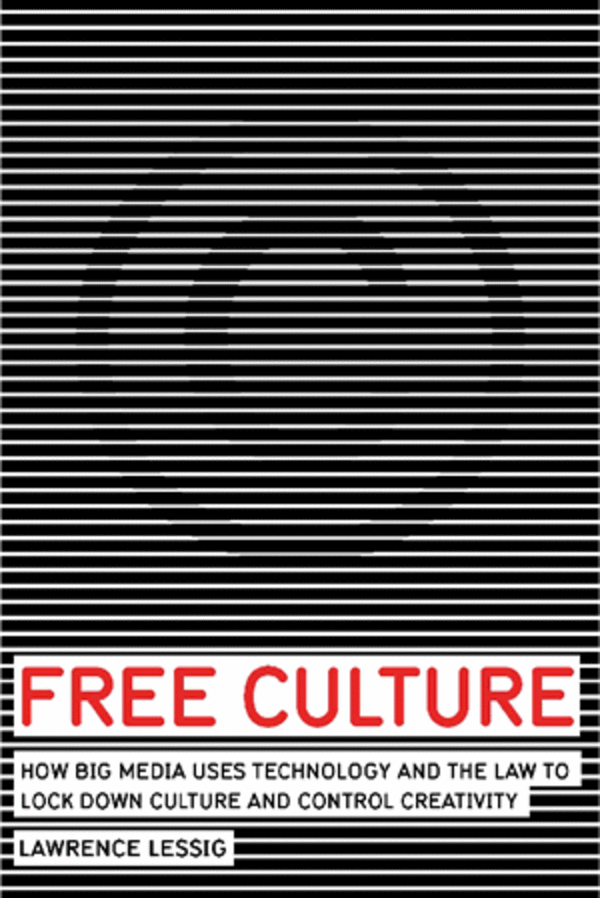
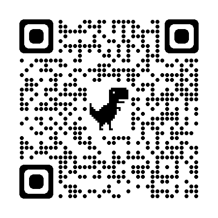

##  书名

《自由文化：创意产业的未来》

英文原名：《FREE CULTURE：How big meida uses technology and the law to lock down culture and control creativity》

## 封面

## 内容简介

作者对这种突破束缚的文化做了极为出色的阐述。他展示给我们的是：遗失了突破束缚的文化市场，我们也就丧失了创作的自由、丧失了构建文化的自由，最终，我们也将丧失想象的自由。

在当今互联网时代，你可曾想到，控制创意的权力从未像今天这样如此集中于少数有权有势的“媒体巨头”手中。他们限定了我们能做什么、不能做什么。他们锁定了文化，并支配创造力朝着有利于他们自己的方向发展。那么，植根于自由市场的我们对这一切应该如何审视呢？

## 作者简介

劳伦斯·莱斯格，现任斯坦福大学法学院教授，是斯坦福大学网络与社会研究中心创始人，全球最负盛名的网络法律专家，被《纽约客》誉为“互联网时代最重要知识产权思想家”，被《商业周刊》称为“互联网时代的守护神”、“网络法律界最具原创思想的教授”、“对互联网最具影响的25人之一”。他几乎参与了所有重大的论争；美国在线-时代华纳合并案、纳普斯特音乐版权大战、俄罗斯黑客事件、DVD破解案……他对美国微软反垄断案审判结果产生了重要的影响。

## 电子版下载地址

作为CC协议的撰写者，Lessig 先生的书均是可自由下载，扫描下面二维码获取：

## 推荐理由

出色的律师，看到的事情总是更为深远，互联网空间下的技术锁定危害大于其可以自由访问的益处，如果你不能理解这点，那么本书就是应该一读再读的。

## 推荐人

[适兕](https://opensourceway.community/all_about_kuosi)，作者，「开源之道」主创。「OSCAR·开源之书·共读」发起者和记录者。