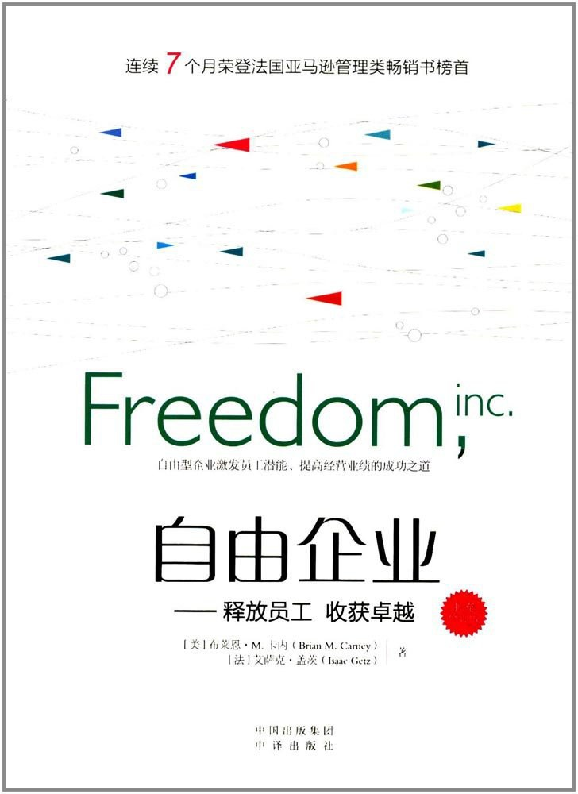

##  书名

《自由企业：释放员工,收获卓越》

英文原名：《Freedom,inc》

## 封面

## 内容简介

《自由企业:释放员工,收获卓越(修订版)》的核心观点是很大限度地给予员工自由，他们会带给公司更高的生产效率、更多的利润和更强劲的发展。这是企业实现持续发展的关键，也是重振企业的一剂决定性良药。

## 作者简介

布莱恩·M.卡内（Brian M.Carney），Ravada网络公司企业通讯高级副总裁。2004—2014年担任《华尔街日报》编辑委员会成员，2004—2005年、2009—2014年期间担任《华尔街日报》欧洲社论版主编。他对雀巢公司（Nestle）董事长彼得·布拉贝克·雷特马斯的采访被收编进《哥伦比亚新闻评论》“2012年度商务写作”。2003年，凭借有关欧洲经济的新闻稿荣获弗雷德里克·巴斯夏新闻奖。2009年，凭借其对金融危机的报道荣获美国最负盛名的商业新闻奖项——杰拉尔德·罗卜评论奖。

艾萨克·盖茨（Hsaac Getz），心理学及管理学双博士，世界顶尖学府——ESCP欧洲商学院教授，康奈尔大学、斯坦福大学和麻省大学客座教授。2010年，凭借有关解放型领导力的研究成果，盖茨荣获Syntec学术文章奖，美国及法国所有主流媒体均对艾萨克的研究成果进行了专题报道。艾萨克独自或与他人合作著作数部，被翻译成数十种语言。此外，他还撰写了大量文章和特约评论，积极发表言论，数百家不问领域的大小型公司及组织因受到艾萨克的启发开始走上解放企业的道路。

## 推荐理由

员工自己会尽最大努力去做事，能够从公司的角度思考问题和行动，也能将自己置于自由的状态，而不是接受管束。这是所有打工人的梦想——按照自己的意愿去经营公司。

## 推荐人

[适兕](https://opensourceway.community/all_about_kuosi)，作者，「开源之道」主创。「OSCAR·开源之书·共读」发起者和记录者。