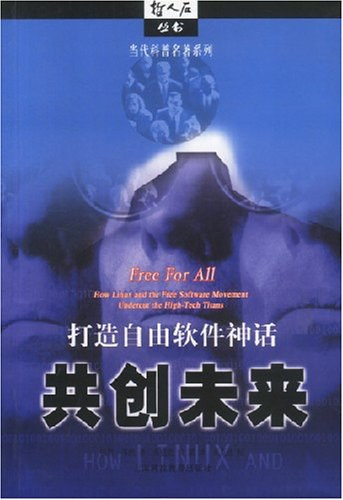

##  书名

《全民自由：Linux和自由软件运动如何抵抗科技巨头》

英文原名：《Free For All: How Linux and the Free Software Movement Undercut the High Tech Titans》

还有一个译名：《共创未来：打造自由软件神话》

## 封面

## 内容简介

本书讲述的是一群来自世界各地，具有奉献精神的软件高手们，利用业余时间，开发一套堪与微软的Windows系统相媲美的“开放”操作系统的故事。作者通过妙趣横生的讲解，向读者介绍了这样一套任何人都可以免费下载使用的操作系统，是如何在程序员中间激起一场平民运动，并在软件产业界引发一场革命的。 本书走进幕后，向我们展示了这场革命众多领袖人物的风采，其中包括自由软件基金会的创始人理查德·斯托尔曼和Linux的缔造者利努斯·托瓦尔兹。你可以从中了解到他们如何以及为何要自由发布自己编写的代码，从而威胁到大公司的霸权，并催生出一个从事Linux产品开发的全新产业。 Linux的故事刚刚开始。这里拉开的就是这部传奇故事的第一幕。

## 作者简介

Peter Wayner，一位美国作家，以其有关技术的书籍以及在纽约时报、InfoWorld 和连线杂志等主流出版物上的写作而闻名。

## 推荐理由

如果你需要完全从不同的视角去看待自由和开源软件运动的话，那么专业作家的视角和看法，以及对于未来的充满幻境的想象和煽动，作为虚构的叙事，是必要的。

## 推荐人

[适兕](https://opensourceway.community/all_about_kuosi)，作者，「开源之道」主创。「OSCAR·开源之书·共读」发起者和记录者。