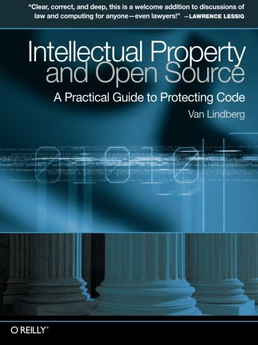

##  书名

《知识财产和开源：保护代码/法典的实践指导》

英文原名：《Intellectual Property and Open Source:A Practical Guide to Protecting Code》

## 封面

## 内容简介

本书适合任何想了解法律体系如何处理代码和其他内容的知识财产权的人。您将从开发人员的角度清楚地了解知识财产权问题，包括有关您可能遇到的情况的实用建议。由同时也是程序员的知识产权律师撰写，《知识产权和开源》可帮助您了解专利、版权、商标、商业机密和许可，特别关注围绕开源开发和 GPL 的问题。本书回答了以下问题：

* 开源和知识财产权如何协同工作？
* 在开展业务或开源项目时，最重要的知识财产权相关问题是什么？
* 在接受来自其他开发者的补丁时，您应该如何处理版权、许可和其他问题？
* 如何在为别人工作的同时实现自己的想法？
* 应该审查专利的哪些部分以查看它是否适用于您的工作？
* 你的想法什么时候是商业机密？
* 如何在不陷入麻烦的情况下对产品进行逆向工程？
* 在为您的项目选择开源许可时，您应该考虑什么？

## 作者简介

Van Lindberg 是一名软件工程师和执业律师。不过，他认为自己最常做的是“翻译”工作 —— 从“律师”到“工程师”，或者是从“工程师”到“律师”。他喜欢使用计算机代码和法律代码来完成工作。Van 目前的工作涉及传统知识产权和开源之法的新兴领域，他为企业和开源团体提供有关知识财产权相关问题的咨询建议。

## 推荐理由

本书实在是太适合开发者去了解知识财产法相关的内容了，开发者最起码也要得知自己的利益该如何维护，不能全依赖劳动合同法。本书应该让开发者人手一本。

## 推荐人

[适兕](https://opensourceway.community/all_about_kuosi)，作者，「开源之道」主创。「OSCAR·开源之书·共读」发起者和记录者。