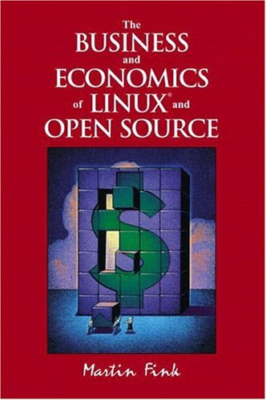

##  书名

《Linux和开源的商业与经济》

英文原名：《The Business and Economics of Linux and Open Source》

## 封面

## 内容简介

针对 CIO 和产品开发主管，本书探讨了与 Linux 和开源相关的商业和经济问题。这本书并没有谈太多关于技术方面的内容，而是聚焦于关于商业业务和开发过程的。该书覆盖内容：

* 评估拥抱 Linux 和开源计划的成本、收益和风险
* 开源许可：避免雷区
* 管理公司内的 Linux 和开源项目
* 评估开源共同体的规模、广度和能力
* 与外部开源共同体建立强大、积极、协同的关系
* Linux 标准的关键作用
* 集成、开发、部署、迁移、共存、支持和培训
* 了解Linux内核和Linux操作系统的区别
* 了解和选择 Linux 发行版
* 开源范式如何影响商业软件开发人员
* 开源商业模式：如何从开源技术中获利
* 在企业环境中应用开源开发方法

## 作者简介

MARTIN FINK 是 Hewlett-Packard 的 Linux 系统部门的总经理，他在该部门领导 Linux 开发活动已超过三年（写作本书时）。他负责推动惠普的整体 Linux 和开源战略，并管理公司的开源业务流程。他还是开源开发实验室（OSDL，Linux基金会前身）的董事会副主席，该实验室是一个由行业领导者组成的全球联盟，致力于为企业和运营商级环境推广 Linux 以及基于 Linux 的编程活动相关。

## 推荐理由

这本20年的书，对于当下的本土依然有着巨大的意义，可能还恰逢其时。如果你没有读过此书，还去和那些不理解开源的人掰扯，那可能不太合适，最好时读完再和他们聊。

## 推荐人

[适兕](https://opensourceway.community/all_about_kuosi)，作者，「开源之道」主创。「OSCAR·开源之书·共读」发起者和记录者。