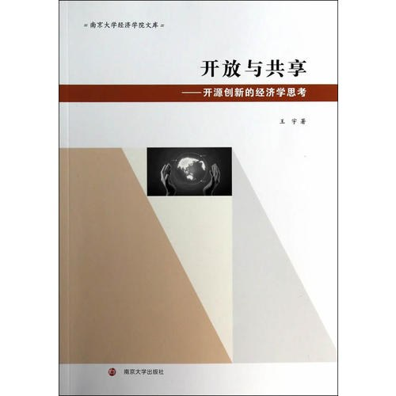

##  书名

《开放与共享---开源创新的经济学思考》

## 封面

## 内容简介

开源创新对传统创新模式的颠覆及其在全世界范围的成功，让我们有理由相信依托互联网独特生态环境并以其为创新平台，以独立分散的个体为创新主体 ，以多元激励为推动力，以民主化开源社区为组织的开源创新模式，在信息化时代的背景下将逐步演化成一种重要的主流创新体系。

基于此，《开放与共享－－开源创新的经济学思考》对这一全新的创新模式展开了经济学思考与实证分析，内容涉及开源创新的激励机制、授权机制、治理机制与组织结构，以及开源创新与商业化。

## 作者简介

王宇，丹麦奥胡斯大学经济学博士，现为南京大学商学院讲师。研究方向为博弈论、创新经济学以及信息产业的竞争策略等。

## 推荐理由

作为一部博士论文扩展而成的小书，本书唯一值得推荐的是经济学的视角，也就是说经济学家如何看待开源，以及研究和入手的角度。

## 推荐人

[适兕](https://opensourceway.community/all_about_kuosi)，作者，「开源之道」主创。「OSCAR·开源之书·共读」发起者和记录者。