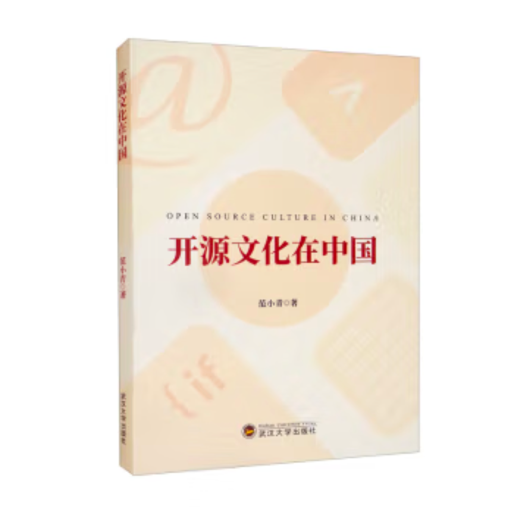

##  书名

《开源文化在中国》

英文名：《Open Source Culture in China》

## 封面

## 内容简介

这是一项关于中国开放源代码运动参与者行动与文化的探索性研究。在将开源参与者视作社会行动者的前提下，《开源文化在中国》通过深度访谈和民族志观察，从技术文化、社群文化、商业文化等方面勾勒了中国大陆开源参与者的行动逻辑与实践面貌，分析和探讨了开源文化在中国的发展及开源文化选择的意义所在。

## 作者简介

范小青，文学博士，中央民族大学新闻与传播学院副教授，硕士研究生导师，新媒体研究中心主任。本科、硕士毕业于武汉大学，博士毕业于北京大学。2019年入选国家民委中青年英才计划。主要研究方向为新媒体与用户创新文化、新媒体与民族文化、广告传播。

## 京东购买地址

[点击进入京东购买链接](https://item.jd.com/13262911.html)。

## 推荐理由

深入了解一项新事物的本质在于了解和读懂其文化，《开源文化在中国》可能是国内第一本对中国的开源文化进行深入研究与洞察的著作。范老师从 2014 年就开始对 28 位中国的开源参与者进行了深度访谈，以创新的新媒体文化角度，对中国开源运动参与者的真实行动实践进行分析和解读，历时八年打磨完成。作为开源爱好者，在阅读过程中能够收获新知和产生共鸣。

## 推荐人

[周鹏飞](https://github.com/feynmanzhou)，微软 Azure 产品经理，CNCF 大使，开源项目贡献者，「OSCAR·开源之书·共读」活动志愿者。
