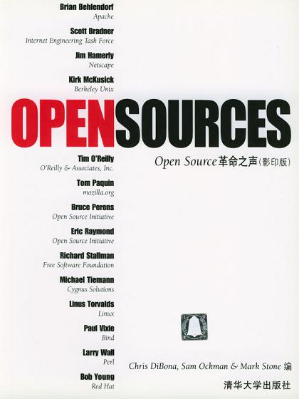

##  书名

《开源软件文集：开源革命之声》

英文原名：《Open Sources: Voices from the Open Source Revolution》

## 封面

## 内容简介

本书中的这些短文透析了Open Source的工作方式、其成功的原因，以及Open Source将去向何方。对于致力于Open Source项目的那些程序员来说，Open Source是一种新的信仰；这项运动的精神领袖们为这些程序员描绘了一幅美好的前景。对于将Open Source软件集成到企业运作中的那些公司来说，Open Source揭示了开放式开发如何能够构建出更好的软件，并揭示出企业如何利用这些免费的软件来取得商业竞争上的优势。

## 作者简介

开源世界的创始人和领袖们，不用一一介绍，光是看名字就如雷贯耳：Eric S.Raymond、Richard Stallman、Michael Tiemann、Linus Torvalds、Robert Young、Larry Wall、Bruce Perens、Tim O'Reilly、Brian Behlendorf。

## 在线阅读地址

本书遵循开源许可，电子版可免费访问：https://www.oreilly.com/openbook/opensources/book/

## 推荐理由

从想象的共同体出发，没有那本书能和本书相比，这是一本来自开源世界的创始人和领袖们的宣言和纲领，无论是技术、商业、社会，都具有高屋建瓴的作用。

毫不夸张地说，没有这本书，就没有开源这回事。

## 推荐人

[适兕](https://opensourceway.community/all_about_kuosi)，作者，「开源之道」主创。「OSCAR·开源之书·共读」发起者和记录者。