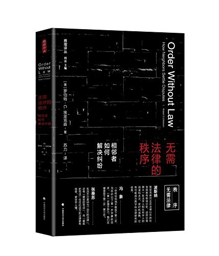

##  书名

《无需法律的秩序:相邻者如何解决纠纷》

英文原名：《Order without Law:How Neighbors Settle Disputes》

## 封面

## 内容简介

本书作者埃里克森以美国加州农场为田野调查对象，向我们展现了两个主题：世界偏僻角落发生的事情可以说明有关社会生活组织的中心问题；法律制定者如果对促成非正式合作的社会条件缺乏眼力，他们就可能造就一个法律更多但秩序更少的世界。

整合了新的法律、经济学、社会学、博弈论以及人类学等学科的文献，阐释了人们大多以非正式规则也即社会规范进行自我治理，而无需国家或是其他位于中心的协调者，探索并向我们展示了一个无需法律却成功实现有序的未知世界。

## 作者简介

罗伯特·C.埃里克森（Robert C.Ellickson），美国当代杰出的财产和城市法学者，耶鲁大学法学院沃尔特·梅耶财产和城市法讲席教授（2015年荣休）。研究主要集中在产权、城市规划和法律与社会规范三个领域，在上述领域皆有经典作品传世，也是被引用多的学者之一。他早年就读于奥柏林学院、耶鲁法学院和麻省理工学院的城市与区域规划系。自1970年起，埃里克森教授先后执教于南加州大学、斯坦福大学和耶鲁大学，在1988年转至耶鲁法学院任教后，常年讲授已经成为耶鲁法学院经典课程的“财产法”。埃里克森是美国法律经济学协会的创始会员，并担任协会主席（2000-2001年），曾获得该协会授予的罗纳德·科斯奖章，系继波斯纳、卡拉布雷西、史蒂文·萨维尔后第四位获此殊荣的学者。埃里克森教授还担任过美国法律协会财产法重述项目的顾问，并且是美国艺术与科学院院士。埃里克森教授还是英文拼字游戏Scrabble的爱好者，世界锦标赛成绩进入过前二十名。《无需法律的秩序：相邻者如何解决纠纷？》是埃里克森教授的代表作，出版于1991年，曾于1996年获得美国法学界三年一度的考尔夫图书大奖，自2003年中文版出版以来，在中国法学界也产生了广泛而且深远的影响。

## 推荐理由

开源极少发生官司，开源并不鼓励劳师动众的诉讼，想理解其中的深层次缘由，本书会给出最清晰的答案，无论是经济的角度，还是法律的角度，开源能发展起来就依赖的是这种秩序。

## 推荐人

[适兕](https://opensourceway.community/all_about_kuosi)，作者，「开源之道」主创。「OSCAR·开源之书·共读」发起者和记录者。