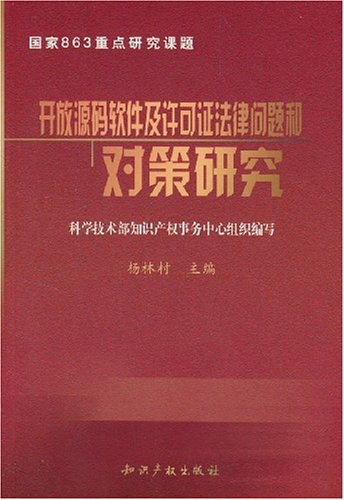

##  书名

《开放源码软件及许可证法律问题和对策研究》

## 封面

## 内容简介

本书是科学技术部知识产权事务中心承担的国家863重点研究课题。由于开放源码软件采用了与传统商业软件截然不同的规则、理念和开发、盈利模式，因此对传统软件的发展带来了巨大的冲击。人们在关注开放源码软件发展的同时，也为其带来的一系列问题而感到困惑。开放源码软件是否能不受限制地使用？能否盈利？如何盈利？其法律风险如何？我国现有法律能否规范其行为？是否存在合理的开放源码公司商业模式？本书的研究就是力图寻找到答案，以利于我国软件产业的发展。本书共分为三篇：第一篇为研究总报告篇，对开源软件相关问题作了全方位的介绍和研究；第二篇是研究分报告篇，节选了北京大学、西安交通大学等单位的研究成果作为总报告的有益补充；第三篇选编了主要开源软件许可证翻译文本，以为读者研究和查阅之用。

## 作者简介

杨林村(时任科学技术部知识产权事务中心副主任) 等编著，具体介绍不详。可以从前言的只言片语中了解一二：

> 本书由科技部知识产权事务中心刘文鹏同志整理，杨林村副主任审定。科技部高新司、科技部高技术研究发展中心以及863软件专项总体组为本课题的研究提供了大量帮助，科技部高新司李武强副司长、梅建平处长、西安交通大学校长郑南宁院士、国家信息中心宁家骏主任以及863软件专项专家组廖湘科教授、刘澎教授、韩乃平教授等对本书提出了有益的建议。

## 推荐理由

数字世界的知识财产权的理解需要先由数字世界，这是一个充分必要条件，退回到本世纪初，本土的信息产业几乎空白的情况下，理解copyleft思想，几乎是不可能的，践行GPL更是缺乏实际，但是并不耽误当时的国家精英对他们的翻译和认知，这个过程十分的重要，尤其对于今天的我们来说。

 -- By <a href="https://opensourceway.community/">适兕</a>  作者,「开源之道」主创，「OSCAR·开源之书·共读」发起者和记录者

