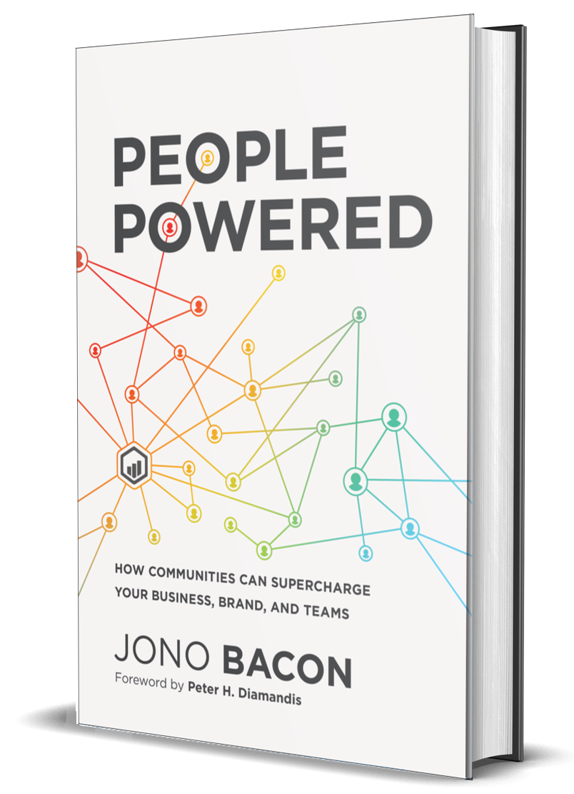

##  书名

《以人为本：共同体如何提升公司业务、品牌和团队》

英文原名：《People Powered:How communities can supercharge your business, brand, and teams》

本书还有个糟糕的译名：《用户共创：社区赋能产品实战手册》

## 封面

## 内容简介

自互联网和社交媒体兴起以来，虚拟共同体一直是一个热门话题。众多公司利用社区力量掌握了行业领先技术，创造了竞争优势，取得了巨大的成功。《以人为本：共同体如何提升公司业务、品牌和团队》提供了创建和运营共同体的经验、方法和工具，解答了以下问题，帮助高级管理人员、创始人、客户倡导者和共同体领导者获得竞争优势：

* 我们建立共同体的关键价值主张是什么？
* 我们需要哪种共同体，以及如何建立并将其集成到组织中？
* 我们如何激励和鼓励共同体成员的参与？
* 我们如何与共同体成员建立真实、富有成效的关系？
* 我们需要避免哪些战略和战术上的陷阱与障碍？
* 如何确保我们与共同体成员一起不断成长？

## 作者简介

Jono Bacon 是卓越的演说家、作家。他目前创建了自己的工作室，为众多企业做咨询和顾问。Jono Bacon 在开源和community 界有着广泛的知名度，以及很高的威望。他曾经担任过的职位有：在 Canonical 担任Community团队的经理、XPRIZE 基金会的社区经理、 GitHub 的社区总监。Bacon 是一名很有特点的作家，Community管理的布道师和实践者。并且是Community领导力峰会（主要定位于社区管理者和领导者的年度会议）的创始人，也是Community领导力论坛的创始人。经常在各种大型的会议就Community管理、领导力、以及最佳实践发表主题演讲。Bacon 还为各种组织和公司提供Community管理的咨询顾问工作，无论社区是公司内部还是外部的，这其中包括有：德国银行、Intel、SAP、索尼移动、三星、开放计算项目、IBM、戴森、Mozilla、全国整理承包商协会、AlienVault等。Bacon 写过非常流行的：[《共同体的艺术：打造参与的新纪元》](the-art-of-community.md)，还是多本书籍的合著者，如《Linux 桌面 Hacks》（O’Reilly）、《官方 Ubuntu 手册》（Prentice Hall）、《PHP 和 MySQL 实践》（Prentice Hall)，同时还在超过12家不同的媒体上发布超过500篇的文章，此外，Bacon 还为杂志定期撰写文章。Bacon 也是著名流行的播客 LugRadio 的联合创始人，LugRadio 运营了4年，超过2百万的下载，以及15，000名忠实听众，并在英国和美国均做过5次的现场直播。同时也是播客 Shot Of Jaq 的联合创始人，以及播客 Bad Voltage 的联合创始人，Bad Voltage 是一个关于技术、开源、政治的蛮流行的播客。Bacon 还创建过很多的项目，如Ubuntu Accomplishments、Jokosher、Acire、Python Snippets、 Lernid 软件等。他和他的妻子 Erica、以及儿子 Jack 幸福的生活在加州的旧金山湾区。

## 推荐理由

开源是基于共同体（community）为核心的一种生产方式，理解共同体和软件技术本身同样重要！《People Powered》在西方的文化背景下，将共同体解决问题的思路、行动、结果诠释的非常通透，值得本土参考和反思。如果不能理解西方意义下的共同体，也就无法建立本土文化的开源协作共同体。

## 推荐人

[适兕](https://opensourceway.community/all_about_kuosi)，作者，「开源之道」主创。「OSCAR·开源之书·共读」发起者和记录者。