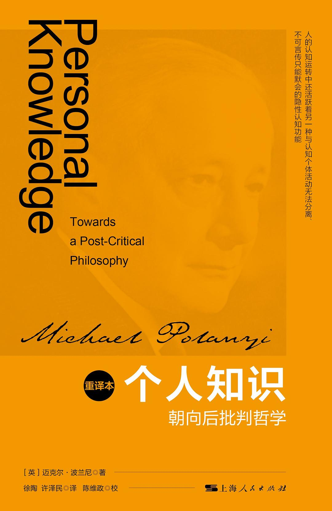

##  书名

《个人知识：朝向后批判哲学》

英文原名：《Personal Knowledge: Towards a Post-Critical Philosophy》

## 封面

## 内容简介

波兰尼颠覆了传统客观主义科学观，把“人”作为科学参与的主体，用一种新的思维方式，通过对人文社会科学与自然科学几乎所有门类知识的考察，批判了客观主义的知识观，通过对知识的隐默性、分立性与寄托性的强调，从而最终构建起了自己以“个人知识”为标识的认识论。波兰尼认为，相对于传统认识论所依托的可明确表述的逻辑理性，人的认知运转中还活跃着另一种与认知个体活动无法分离、不可言传只能默会的隐性认知功能，而这种默会认知正是一切知识的基础和内在本质。

## 作者简介

迈克尔·波兰尼(1891—1976)是一位英籍犹太裔物理化学家和哲学家，其在科学哲学方面的建树，尤其对集体主义社会的分析和批判，引起西方思想界的重视，是20世纪具有重大影响的自由主义思想家。著有《社会、经济和哲学》、《波兰尼文选》和《个人知识》等。

## 推荐理由

开源其实是因为软件和互联网的诞生而形成的新的人类事物，它复杂而新颖，但是它仍然在人类知识和智力的范畴，尤其是开源的流行，除了和数字世界有关之外，它还是个人的。软件开发和协作，为什么能够在当今实现？想要回答这个问题，还是先要了解人如何处理知识与技艺。

 -- By <a href="https://opensourceway.community/">适兕</a>  作者,「开源之道」主创，「OSCAR·开源之书·共读」发起者和记录者
