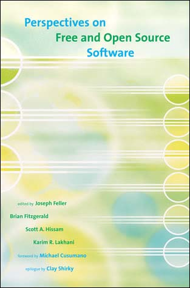

##  书名

《自由和开源软件洞察论文集》

英文原名：《Perspectives on Free and Open Source Software》

## 封面

## 内容简介

本书是学术圈的专门会刊，由来自各个领域、多个高校的教授、博士们撰写的合集，围绕开源所衍生的各种探索和总结。

该书区分了五大部分：

### 自由/开源软件开发的动机

该部分遴选了三篇文章，重点诠释人们开发自由/开源软件的背后动机，从多个角度来说明：技能提升、声誉、礼物经济、金钱激励等。

### 自由/开源软件开发的演化

从科学哲学的角度讲，没有什么是一成不变的，自由/开源软件本身也在发生着进化/演化。让我们从十几年之后去看，还是非常之明显的。

### 自由/开源软件的过程和工具

主要是从软件工程的角度来考察开源，有详尽的优秀的项目跟进。

### 自由/开源软件经济和商业模式

创新、服务、垄断、商业秘密等角度来阐释自由/开源软件对于商业的影响。

### 法律、共同体和社会

人类的协作是不可能凭空产生的，必须有强大的社会体系作为支撑的，人类在历史上走过很多的弯路，这部分开源之道认为才是本书的精华部分，无论是法律上的诠释，还是共同体的治理，以及背后的社会机制，都是值得学习和思考的地方。

## 作者简介

* Audris Mockus：现任美国田纳西大学电气工程与计算机科学系 Harlan D.Mills 首席教授。他于卡耐基梅隆大学获得硕士、博士学位，毕业后曾担任卡耐基梅隆大学统计学部客座助理教授、贝尔实验室软件产品研部的科研人员。之后 Mockus 教授担任 Avaya 实验室研究科学家，致力于软件工程、软件数据挖掘等方面的研究。
* Siobhan O’Mahony：（贡献该书时）是哈佛商业学校的助理教授，她拥有斯坦福大学的科学和工程管理的博士学位，方向为组织学习，她的研究是对自由和开源软件的80多位领导者们的访谈和观察，以检验一个基于共同体管理的软件项目如何设计治理架构，采用新的原则来进行协作，是一位非常多产的研究开源共同体治理和基金会组织的专家学者。
* Tim O’Rilly ： 是 O’Reilly 媒体的创始人兼CEO，众所周知，O’Reilly 出版过非常多的优秀的技术书籍，尤其是和开源相关的，关于其本人就更具传奇色彩了，Web 2.0的提出者，开放源代码运动的领袖人物，在IT 领域有着极大的影响力。
* Eric von Hippel： 教授，MIT Sloan 管理学院的创新和企业的带头人，Hippel 教授的研究重点是创新的源头和经济，特别聚焦于来自普通大众在工程中的创新，开源之道图书共读活动明年会选取Hippel的两本经典著作。

## 推荐理由

开源其实需要逆向思维的，也就是说当人人都能看到代码托管平台、非盈利软件基金会、上市公司、优秀项目、重大会议活动等时，没什么了不起的，这是公众事件。真正需要的是去追寻其这些浮出水面之下的内容：匠人、共同体、原则、哲学、决策、法律、文化 …… 而这正是这本书告诉给我们的，学习和研究开源应该往哪里去努力。

## 推荐人

[适兕](https://opensourceway.community/all_about_kuosi)，作者，「开源之道」主创。「OSCAR·开源之书·共读」发起者和记录者。
