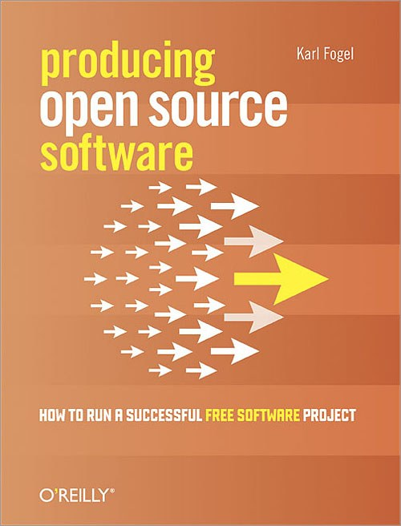

##  书名

《生产开放源代码软件:如何成功构建一个自由/开源软件项目》

英文原名：《Producing Open Source Software：How to Run a Successful Free Software Project》

## 封面

## 内容简介

这是一本书名运用的极为精准的书籍，诚如其名，就是为读者呈现自由/开源软件是如何生产出来的。全书分为九章：以及一个前言和附录A。如果说要开始一个开源项目，这本书堪称全面。

## 作者简介

Karl Fogel 因为这本被引用最多的书而驰名于开源界。但是他参与过的开源项目可都是大名鼎鼎的：Launchpad、Subversion、GNU EMACS等，Karl也在非营利组织做事，如OSI、ASF、SFC等。

## 在线阅读

本书电子版，遵循开放版权，可免费在线访问和下载。

在线阅读地址：https://producingoss.com/ 

## 推荐理由

超越技术的开放源代码软件讲解之道，无论是从软件工程的角度，还是项目管理的角度，这本书是把开源项目这件事讲透了。除此之外，别无他求。

## 推荐人

[适兕](https://opensourceway.community/all_about_kuosi)，作者，「开源之道」主创。「OSCAR·开源之书·共读」发起者和记录者。
