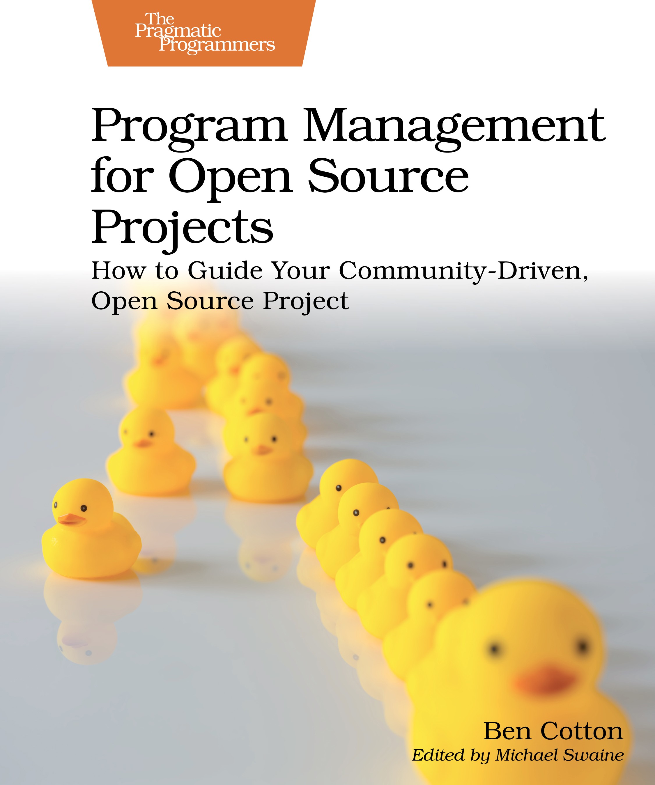

##  书名

《开源项目的计划管理：如何指导共同体驱动的开源项目》

英文原名：《Program Management for Open Source Projects: How to Guide Your Community-Driven, Open Source Project》

## 封面

## 内容简介

每个组织都可能会形成官僚机构，开源项目也不例外。如果你的组织结构是有意为之并服务于项目，那么它就能带来成功和可预见的结果。但是，仅靠项目管理并不能达到目的，而是是更为全面的开源项目管理。成为促进团队间沟通、管理时间表和项目生命周期、协调变更流程以及保持会议高效的专家，做出获得各方支持的决策，学习如何以恰到好处的组织结构指导共同体驱动的开源项目。

了解计划管理与项目管理的不同之处。通过建立关系、共享信息和有效沟通，建立信任和信誉。构建高效的决策和管理结构，做到公开、责任明确。召开更有效、更愉快的会议。针对要讨论的问题召开合适的会议：短信、电话、视频或面对面。制定发布生命周期，包括发布规划、时间表和 "去/不去 "决策，并按计划进行。创建并管理有效的变更流程。使用错误跟踪器更好地了解和管理项目中的错误和功能请求。做出能得到所有相关人员支持的决策。

制定为开源项目服务的流程，而不是让项目为流程服务。

## 作者简介

Ben Cotton 是红帽公司的 Fedora 项目经理。十多年来，他一直为 Fedora 项目和其他开源项目做出贡献。Ben 的职业生涯横跨公共和私营部门的多个岗位，包括系统管理、软件开发和市场营销。他是开放组织大使和 Opensource.com 通讯员。Ben 拥有普渡大学 IT 项目管理硕士学位。

## 推荐理由

软件工程的方式有很多，但是开源的软件工程却成为了“默会”知识，因为没有哪一本书是讲解开源项目的软件工程的，因为开源项目有一个工程意义上的大难点：没有人力预算～ 本书的出现，像很多经济学家一样，会假设一些人力。这或许是开源能够不被称之为“艺术”的可能性发展。

 -- By <a href="https://opensourceway.community/">适兕</a>  作者,「开源之道」主创，「OSCAR·开源之书·共读」发起者和记录者

