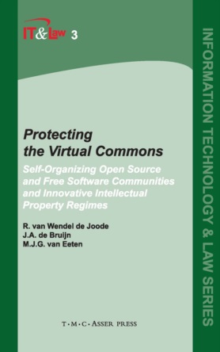

##  书名

《保护虚拟公域--自组织开放源代码和自由软件社区与创新知识产权制度》

英文原名：《Protecting the Virtual Commons - Self-Organizing Open Source and Free Software Communities and Innovative Intellectual Property Regimes》

## 封面

## 内容简介

Worldwide, governments and businesses are recognizing the added value of open source and free software. Unlike other software, this software is developed and continuously improved by volunteers in communities on the Internet. Some of these communities, like Linux and Apache, connect thousands of volunteers worldwide. The question is how these communities are able to continuously develop innovative software in a world dominated by markets, companies and laws.

Protecting the Virtual Commons informs us about the surprisingly creative solutions that explain the long-lasting stability of these communities. It identifies the threats that the communities are faced with and discusses the amazingly innovative strategies developed to neutralize these threats. The book has been written with a clear focus on intellectual property rights.

In their analysis, the authors provide answers to the following questions: Why have open source and free software communities created so many different licenses to protect their intellectual property? What influence do licenses have on the organization of the communities and their ability to innovate? What are the differences between intellectual property rights on software in Europe and the United States? What are the tensions between the way in which open source and free software communities deal with intellectual property and the way in which companies protect and use intellectual property? What regulatory arrangements can deal with the tensions between the corporate model and the open source and free software development model?

## 作者简介

* Author: R. van Wendel de Joode, Technische Universiteit Delft, The Netherlands
* Author: J.A. de Bruijn, Technische Universiteit Delft, The Netherlands
* Author: M.J.G. van Eeten, Technische Universiteit Delft, The Netherlands

## 推荐理由

人是天生的趋利者，所以人们经常问的问题是：“”开源究竟对个人来讲有何前途？或者开源本身是否会成为社会主流？“ 可是事实的真相是，开源需要被保护，是一直以来都被排除在主流之外的边缘，它尽管提供了超级的经济价值、社会价值，以及知识的基础，但是它却是在强保护数字知识产权扩张下的”幸存者“，本书非常坦诚的从一开始就承认了这点，然后总结人们都做了什么让开源没有消失在历史的长河中。本书给我从制度安排的角度以极大的启发！

 -- By <a href="https://opensourceway.community/">适兕</a>  作者,「开源之道」主创，「OSCAR·开源之书·共读」发起者和记录者
