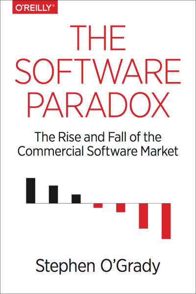

##  书名

《软件悖论:商业软件的崛起与陨落》

英文原名：《The Software Paradox: The Rise and Fall of the Commercial Software Market》

## 封面

## 内容简介

全书共六章内容。

第一章，作为开篇，像很多好书一样，讲了一个精彩的故事，引起读者的思考。

内容就是从大历史的视角来看商业软件市场的起伏，以典型的公司为例说明，开篇以微软分离出操作系统作为软件许可证分发的商业模式，创造了商业上的神话，创新性的颠覆了当年的巨头IBM售卖硬件的模式。但是三十多年过去了，软件越发的重要，但是售卖软件，或者说传统的售卖授权的方式却越来越难了。

第二章，作者比较了两个时代的软件公司，一类是以收取软件许可费用或服务形式的大型商业公司，如微软、IBM、SAP等，另外一类是巨大的软件公司，但是并不依赖软件本身来赚钱，甚至很多项目都是开源的，如Google、Apple、FaceBook等。并以断代史的方式来说明软件商业化的变迁。

第三章，开始具体的阐述软件市场沉浮的背后运行机制。如

* 没有谁能挑战得了免费？
* 来自 X as a service 的挑战
* 来自客户本身的挑战
* 来自开发者本身的觉醒与诉求

第四章，讲述的是具体的商业公司来如何利用软件来进行盈利。时代变了，创新也在不断的发生变化，看这些优秀的公司是如何脱颖而出的。针对不同的群体和软件类型，做了分门别类。如Adobe、Amazon、Apple、Atlassian、IBM、Nest、Oracle、Salesforce、VMware/Pivotal等。

第五章，主要是告诉读者，如果你想以生产软件安身立命，或者改变世界，那么需要变化思路，有几条可能的方案是出路。当然你也可以选择不变，认为世界没有变也不会变。无论你承认与否，单单依靠软件来赚钱是越来越难了。现在考虑一下售卖许可证之外的商业模式吧，多样化总是没有错的：

* 订阅模式
* 提供自己的软件即服务
* 围绕数据来构建
* 将软件视为一种固定资产，而不是现金
* 全栈创业
  
第六章，也是最后一章，祝福之类的，生于一个软件时代，要把握机遇！

## 作者简介

Stephen O’Grady 是知名专注于开发者行业的分析公司RedMonk 的联合创始人，在RedMonk， Stephen 和诸如 IBM、DELL、VMWare、RedHat 等IT公司合作解决各种问题。有超过十多年的丰富经验，文章经常被各大财经媒体引用，如纽约时报、NPR、波士顿全球、华尔街日报等，他也是各种会议的主持人和受欢迎的演讲者。在创立 RedMonk 之前，Stephen 是 Illuminata 的分析师，并曾担任领先系统集成商的高级职位。作为一名终身红袜队球迷，斯蒂芬是威廉姆斯学院的毕业生，与家人一起住在缅因州中部。

## 推荐理由

这是一本提高软件工程师对于软件认知的不可多得的好书，随着软件的复杂度的上升，作为个体的开发者或工程师越发的重要，更可怕的是软件到底在社会中起着什么样的作用？在资本商业的时代，软件究竟是如何来被商业所利用的？直接的交易？间接的服务？开源软件为什么没有人给钱，就冲这一点就让人忿忿不平，然而，世界何其大，不妨了解一下，准确定位自己的位置。

经典书评，扫码阅读：

## 推荐人

[适兕](https://opensourceway.community/all_about_kuosi)，作者，「开源之道」主创。「OSCAR·开源之书·共读」发起者和记录者。