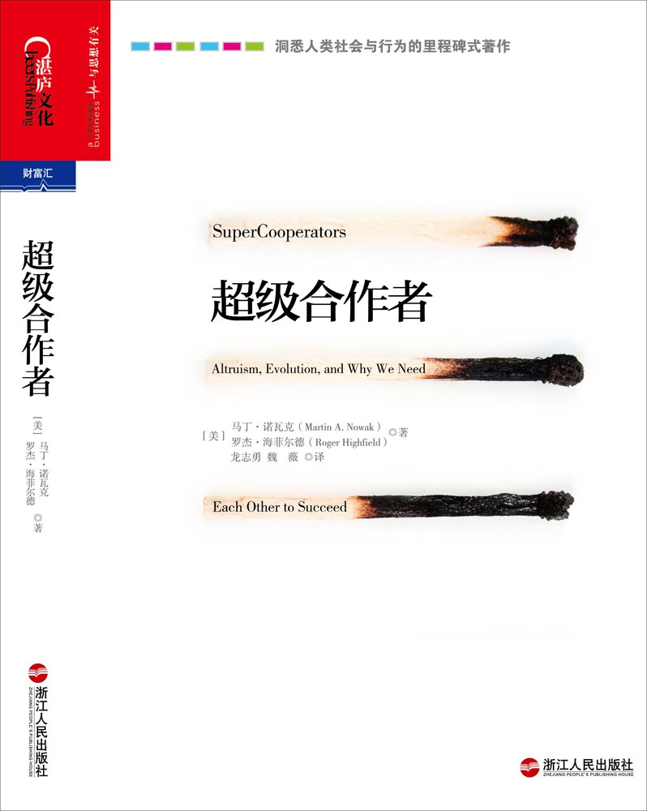

##  书名

《超级合作者》

英文原名：《Super Cooperators: Altruism, Evolution, and Why We Need Each Other to Succeed》

## 封面

## 内容简介

这是一部洞悉人类社会与行为的里程碑式科普著作。作者马丁•诺瓦克从生物学、数学、社会学、计算机科学等多学科角度出发，深入剖析并阐述了生物之间“合作”得以达成的五种机制——直接互惠、间接互惠、空间博弈、群体选择以及亲缘选择。同时极具洞见地指出，合作是继突变和自然选择之后的第3个进化原则。

《超级合作者》从博弈论之囚徒困境入手，生动展现了自达尔文创立进化论以来，生物学和进化动力学最重要、也最激动人心的进展。作者认为，借助于“合作”的力量，组织的建设者和管理者可以收获更强劲的团队凝聚力，人类社会可以达成更大化的长期利益，比如解决环境污染、应对气候变化、消除饥荒、突破癌症治疗等方面，从而更好地共存于这个伟大的地球上，让基因得以延续。

## 作者简介

[美]马丁•诺瓦克 (Martin A. Nowak)，哈佛大学数学与生物学教授，进化动力学中心（PED）主任，与著名生物学家理查德•道金斯和爱德华•威尔逊齐名的科学巨星。

[美]罗杰•海菲尔德 (Roger Highfield)，《新科学家》杂志（New Scientist）编辑，科普畅销书作家。

## 推荐理由

这本书没提到一句开源，但又处处在解释开源；比较通俗，虽然作者强调自己是在解析囚徒困境然后通过数学建模来解释合作；

## 推荐人

杨振涛@vivo互联网
