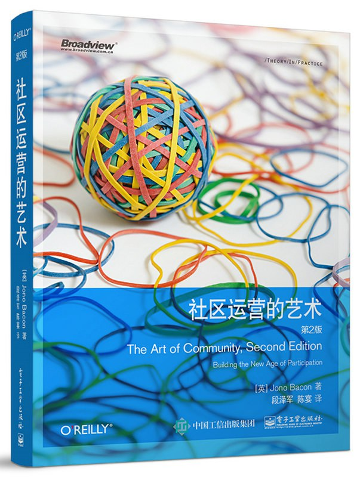

##  书名

《共同体的艺术：打造参与的新纪元》 

英文原名：《The art of community : Building the new age of participation》

本书还有一个被耽搁的糟糕的译名：《社区运营的艺术》

## 封面

## 内容简介

作者用自己多年经验和教训试着给读者提供一些参考，包括如何建立战略规划、如何进行有效的沟通、如何创建简单易用的流程、如何运用社交媒体扩大社区的影响力等。

## 作者简介

Jono Bacon 是卓越的演说家、作家。他目前创建了自己的工作室，为众多企业做咨询和顾问。Jono Bacon 在开源和community 界有着广泛的知名度，以及很高的威望。他曾经担任过的职位有：在 Canonical 担任Community团队的经理、XPRIZE 基金会的社区经理、 GitHub 的社区总监。Bacon 是一名很有特点的作家，Community管理的布道师和实践者。并且是Community领导力峰会（主要定位于社区管理者和领导者的年度会议）的创始人，也是Community领导力论坛的创始人。经常在各种大型的会议就Community管理、领导力、以及最佳实践发表主题演讲。Bacon 还为各种组织和公司提供Community管理的咨询顾问工作，无论社区是公司内部还是外部的，这其中包括有：德国银行、Intel、SAP、索尼移动、三星、开放计算项目、IBM、戴森、Mozilla、全国整理承包商协会、AlienVault等。Bacon 还是多本书籍的合著者，如《Linux 桌面 Hacks》（O’Reilly）、《官方 Ubuntu 手册》（Prentice Hall）、《PHP 和 MySQL 实践》（Prentice Hall)，同时还在超过12家不同的媒体上发布超过500篇的文章，此外，Bacon 还为杂志定期撰写文章。Bacon 也是著名流行的播客 LugRadio 的联合创始人，LugRadio 运营了4年，超过2百万的下载，以及15，000名忠实听众，并在英国和美国均做过5次的现场直播。同时也是播客 Shot Of Jaq 的联合创始人，以及播客 Bad Voltage 的联合创始人，Bad Voltage 是一个关于技术、开源、政治的蛮流行的播客。Bacon 还创建过很多的项目，如Ubuntu Accomplishments、Jokosher、Acire、Python Snippets、 Lernid 软件等。他和他的妻子 Erica、以及儿子 Jack 幸福的生活在加州的旧金山湾区。

## 在线阅读

本书电子版以 Creative Commons 协议发行，扫描下方二维码下载阅读：
 

## 推荐理由

开源的核心就是共同体，也就是说铸就开源成功的重要因素之一就是共同体的构建，本书会告诉你构建一个可参与的共同体的方方面面。

## 推荐人

[适兕](https://opensourceway.community/all_about_kuosi)，作者，「开源之道」主创。「OSCAR·开源之书·共读」发起者和记录者。