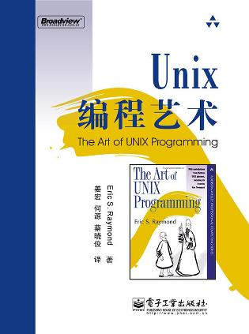

##  书名

《UNIX编程艺术》

英文原名：《The Art of UNIX Programming》

## 封面

## 内容简介

本书主要介绍了Unix系统领域中的设计和开发哲学、思想文化体系、原则与经验，由公认的Unix编程大师、开源运动领袖人物之一Eric S. Raymond倾力多年写作而成。包括Unix设计者在内的多位领域专家也为本书贡献了宝贵的内容。本书内容涉及社群文化、软件开发设计与实现，覆盖面广、内容深邃，完全展现了作者极其深厚的经验积累和领域智慧。

## 作者简介

Eric S. Raymond是开源运动和黑客文化的元老级人物，他是INTERCAL编程语言的主要创作者之一，是Fetchmail程序的作者，并为EMACS编辑器作出过贡献。1997年以后，他成为开放源代码运动的主要理论家，以及开放源代码促进会的主要创办人之一。

## 推荐理由

开源能够成功的基本条件之一就是软件开发是的设计，Linux 的崛起离不开 UNIX 带来的所有优秀实现，作为顶级的布道师的作品，本书是了解开源核心的必读。

## 推荐人

[适兕](https://opensourceway.community/all_about_kuosi)，作者，「开源之道」主创。「OSCAR·开源之书·共读」发起者和记录者。