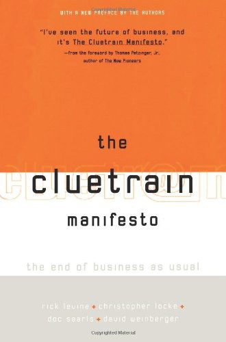

##  书名

《线车宣言：传统商业的终结》

英文原名：《The Cluetrain Manifesto： The End of Business as Usual》

## 封面

## 内容简介

互联网的真正威力不在于技术本身，而在于它对人们生活方式的巨大改变，这些改变不仅深刻影响了市场，也影响了公司的性格。

《互联网的本质》是互联网经济的前瞻性作品，阐明了互联网的95条军规，论述了基于工业时代的传统商业模式的终结，指出互联网超链接的本质属性，这是组织结构和运行规则的深层巨变。

从重新定义商业到企业再造，在新经济条件下，只有顺导互联网超链接力量的企业才能生存和壮大。本书从战略定位、商业架构、市场格局等方面，指导企业应对变革，顺势而为，建立良性循环机制，破茧重生。

## 作者简介

【美】里克·莱文，互联网前沿观察者，赛斯·埃利斯巧克力公司（Seth Ellis Chocolatier）创始人，曾供职于SUN微系统公司Java软件部门。

克里斯托弗・洛克，在科罗拉多州出版了《熵梯度逆转》，曾经在富士通公司、Ricoh公司、卡内基－梅隆大学、Mecklermedia公司、MCI公司和IBM公司工作，并为《福布斯》、《互联网世界》、《信息周刊》和《产业标准》等撰写过大量文章。

戴维・瑟尔斯，《LINUX资深编辑，负责编辑新兴商业方面的文章。他在商业领域摸爬滚打多年，与人合资成立Hobskins Simone＆Searls公司，曾一度是硅谷的主要广告代理商。他为《OMNI杂志》、《个人电脑》、《逆流》、《地球和邮件》以及自己的网络杂志《现实2.0》撰文供稿。

戴维・温伯格，《JOHO》免费杂志的出版人，美国公共广播电台《时事纵横》栏目的评论员，KMWorld和Intranet Desingn Magazine专栏作家。他还为《连线》、《纽约时报》等各种媒体撰稿，并在世界各地举办过演讲会，讨论网络对商务的作用。

## 推荐理由

互联网改变了很多东西，包括其自身的改进，开源的商业模式始终是让人着迷的，因为这关乎人的终极关怀。本书会给读者带来非常大的启发。尤其是那句“市场即对话”。

## 推荐人

[适兕](https://opensourceway.community/all_about_kuosi)，作者，「开源之道」主创。「OSCAR·开源之书·共读」发起者和记录者。