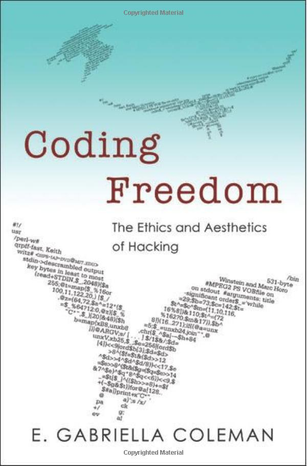

##  书名

《码出自由》

英文原名：《Coding Freedom: The Ethics and Aesthetics of Hacking》

## 封面

## 内容简介

计算机的Hacker是谁？啥又是自由软件？一个致力于生产自由和开源软件的共同体是如何涌现出来的 —— 还把 Hacker 作为一个技术、美学和道德项目 ——是揭示当代自由主义的价值观？探索美国和欧洲自由开源软件 (F/OSS) 运动的兴起意义，Coding Freedom 详细介绍了Hacker致力于 F/OSS 背后的道德规范、指导其生产的社会准则以及Hacker质疑版权和专利法的范围和方向的斗争。在讲述 F/OSS 运动的故事时，这本书展开了一个涉及计算、访问和知识产权的更广泛的叙述。

E. Gabriella Coleman 跟踪Hacker协作的方式，并研究热情的宣言、Hacker幽默、自由软件项目治理和大型的Hacker 会议。通过观察 Hakcer 们对于自由的可持续发展的方式，Coleman 试图表明，这些Hacker们在对工作承诺的推动下，重新制定了包括言论自由、透明度和精英管理在内的关键理想，并拒绝限制性的知识保护。Coleman 向世人们展示了那些经常被边缘化或被误解的 Hakcer 们是如何在在线协作中的保持自身发展的。

## 作者简介
E. Gabriella Coleman  是哈佛大学人类学系的正教授，也是伯克曼互联网与社会中心的教员。作为一名人类学家，她的学术研究涵盖了Hacker的政治、文化和伦理。她是两本关于计算机 Hacker 的书籍的作者，也是 Hack_Curio（一个进入Hacker文化的视频门户）的创始人和编辑。

## 推荐理由

开源是文化的产物，想象的共同体，如果不能挖掘到它最初的文化起源，那么我们就无从理解开源的内在因素。而且必须想本文的作者一样，深入到开发者中间，才能体会和试图理解他们。

## 推荐人

[适兕](https://opensourceway.community/all_about_kuosi)，作者，「开源之道」主创。「OSCAR·开源之书·共读」发起者和记录者。