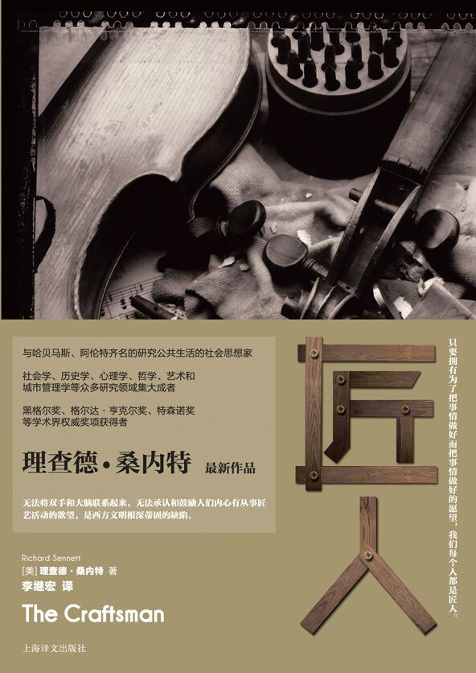

##  书名

《匠人》

英文原名：《The Craftsman》

## 封面

## 内容简介

《匠人》要探讨的是一种基本的人性冲动：纯粹为了把事情做好而好好工作的欲望。尽管匠人这个词让人联想到一种随着工业社会的到来而消失的生活方式，桑内特却认为，匠人的领域远远大于熟练手工劳动的范围；今天的程序员、医生、父母和公民都需要了解匠人精神的价值所在。

本书堪称作者的巅峰巨著，这位当代顶尖的公共知识分子在书中探讨了过去和现在的匠人的工作；他把身体劳动和伦理道德联系起来，他质疑当今公认的衡量工作好坏的标准。

理查德•桑内特在《匠人》中跨越了时空，从古罗马的制砖工人到文艺复兴时期的金匠，从巴黎的印刷社到伦敦的工厂，都是他笔下探讨的对象。历史在实践和理论、技艺和表达、匠人与艺术家、制造者与使用者之间划下了一道错误的界线；现代社会仍然没有摆脱这种历史遗存的折磨。但从前那些匠人的生活和他们的匠艺也揭示了一些使用工具、安排工作和思考材料的方法，进而为我们如何利用技能来指导生活提供了各种可行的方案。

## 作者简介

理查德•桑内特（Richard Sennett），当代著名社会学家和思想家，曾任纽约大学、伦敦政治经济学院教授，目前担任剑桥大学社会学系杰出访问教授，因其在社会学、城市规划研究等方面的杰出贡献，屡获黑格尔奖、斯宾诺莎奖、格尔达·亨克尔奖和特森诺奖等国际奖项。他的主要著作有：《19世纪的城市》（1969）、《阶级中隐藏的伤害》（1972）、《眼睛的良心》（1990）、《公共人的衰落》（1976）、《肉体与石头——西方文明中的身体与城市》（1994）、《不平等世界的尊敬》（2003）、《新资本主义的文化》（2006），以及三部小说。

## 推荐理由

开源的项目是匠人所作，否则它不会被世界所认可，更加不会成为数字世界的基础设施，它出色的作品，抵消了被其它扼杀力量的强大碾压式的攻击，终于脱颖而出，这是开源的核心力量之一。

## 推荐人

[适兕](https://opensourceway.community/all_about_kuosi)，作者，「开源之道」主创。「OSCAR·开源之书·共读」发起者和记录者。