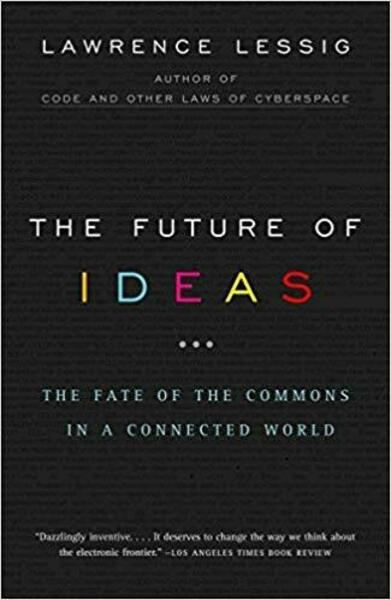

##  书名

《思想的未来:网络时代公共知识领域的警世喻言》

英文原名：《The Future of Ideas:The fate of the commons in a connected world》

## 封面

## 内容简介

Lawrence Lessig 对因特网革命中为何会出现一种反革命的破坏性力量及后果做出了解释。创作之所以繁荣，是因为因特网保护了创新的公共资源。是因为因特网保护了创新的公共资源。因特网的独特设计营造出一个中立的平台。最广大范围的作者们可在此平台上进行试验。围绕此平台的法律架构对这一自由空间给予了保护，以使文化和信息——我们这个时代的思想能够自由流动，从而激发出了空前广泛的思想成果。但是，这种架构设计正在改变——无论是法律层面，还是技术层面。

## 作者简介

Lawrence Lessig，现任斯坦福大学法学院教授，是斯坦福大学网络与社会研究中心创始人，全球最负盛名的网络法律专家，被《纽约客》誉为“互联网时代最重要知识产权思想家”，被《商业周刊》称为“互联网时代的守护神”、“网络法律界最具原创思想的教授”、“对互联网最具影响的25人之一”。他几乎参与了所有重大的论争；美国在线-时代华纳合并案、纳普斯特音乐版权大战、俄罗斯黑客事件、DVD破解案……他对美国微软反垄断案审判结果产生了重要的影响。

## 电子版下载地址

作为CC协议的撰写者，Lessig 先生的书均是可自由下载，扫描下面二维码获取：

## 推荐理由

数字时代的知识财产法应该重新思考，并做出相应的立法，为什么源代码一定要开放？这不仅仅是技术原因，事关创新、表达和知识财产的分配。互联网改变了很多事情，知识财产法律也应该做出对应的改变。

## 推荐人

[适兕](https://opensourceway.community/all_about_kuosi)，作者，「开源之道」主创。「OSCAR·开源之书·共读」发起者和记录者。