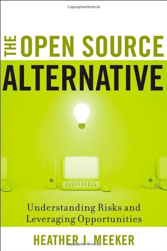

##  书名

《另类开源：理解风险与把握机会》

英文原名：《The Open Source Alternative:Understanding Risks and Leveraging Opportunities》

## 封面

## 内容简介

本书是一本用户手册，用于理解和部署商业中的开源软件许可。它为律师和商业人士而写，解释和分析开源许可问题，并就如何在商业环境中处理开源许可提供实用建议。这本书包括有用的表格、信息以及技术和许可背景，将帮助您避免法律陷阱并教育您的组织了解开源的风险。

## 作者简介

Heather Meeker 是O’Melveny & Myers’ Silicon Valley office in the Mergers and Acquisitions practice group的 合伙人，以及 OSS资本的创始投资组合合伙人。

Meeker 是知识产权界的传奇人物了，不仅是代表Google 和Oracle 就Android 和Java 的官司的首席律师，也是著名的Cisco 和FSF 案件的Cisco的代表方，代表Cisco 处理与Free Software Foundation达成的关于遵守GPL和LGPL的诉讼。

就当前的云计算厂商和开源厂商的许可证，Meeker 也是代表MongoDB 提出SSPL许可的主要人物，也是Elastic 许可v2的起草者。

Meeker 除了执业律师之外，也是著述颇丰的写作者，比如本书，还有一本已经出版的《A Primer on Technology Licensing 》，另外发表在网络上的文章也是超级多的。

总而言之，是一位极为优秀的全能者，既能写程序，也能打官司，复合型人才开挂的典范。

关于Heather Meeker的更多详细介绍，请访问其个人主页：[https://heathermeeker.com/about-me/](https://heathermeeker.com/about-me/)

## 推荐理由

对于习惯了专有许可的律师和商务人士，理解起开源及其许可就像让他们投降到敌人那里一样，是一件艰难无比的事情，但是，这本书会让人们在理性、轻松的视角中理解开源，重新矫正人们的偏见。

## 推荐人

[适兕](https://opensourceway.community/all_about_kuosi)，作者，「开源之道」主创。「OSCAR·开源之书·共读」发起者和记录者。

