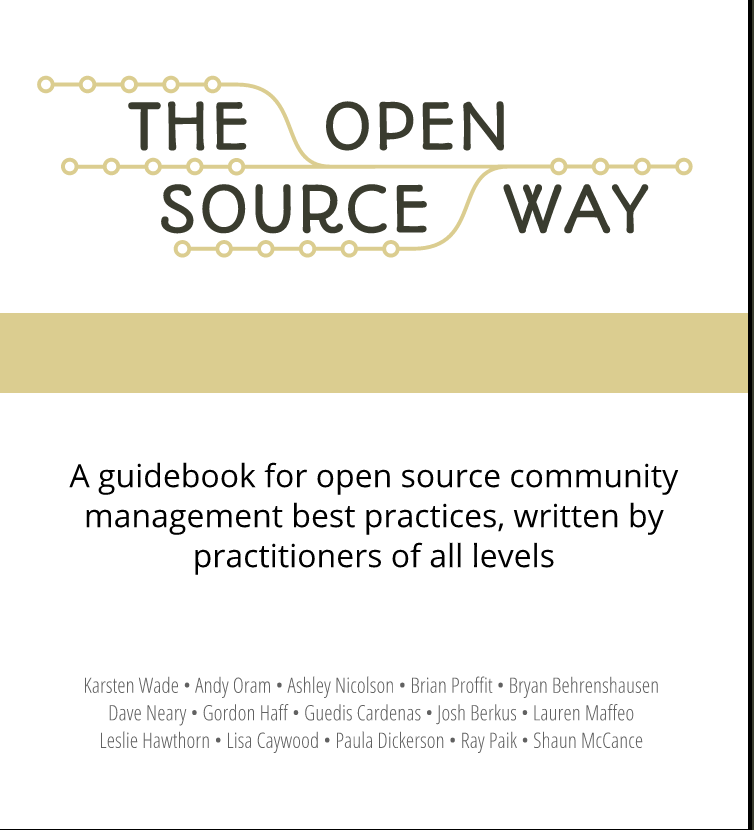

##  书名

《开源之路》

英文原名：《The Open Source Way》

## 封面

## 内容简介

开源之路是一种思考人们如何在共同体内协作以实现共同目标和利益的方式。

对于开源的方式，人们会直觉上询问：**成功且可持续地创建和维护开源软件项目的实践都有什么？是如何做到的？以及发生这一切背后的原理是什么**。 本书会尝试给出答案。
  

## 作者简介

这本书亦是用开源的方式来完成的。作者来自RedHat 开源项目办公室团队的成员以及各个开源项目共同体的领袖。

## 在线阅读

本书采用CC-BY-SA 4.0，扫码二维码阅读：

## 推荐理由

作为开源世界的标杆企业——RedHat，尽管它盛名在外，但是在开源项目共同体的最为“基层”的工作，却鲜为人知，本书就是这些可以让你的双手“弄脏”的实践。强烈推荐！

## 推荐人

[适兕](https://opensourceway.community/all_about_kuosi)，作者，「开源之道」主创。「OSCAR·开源之书·共读」发起者和记录者。