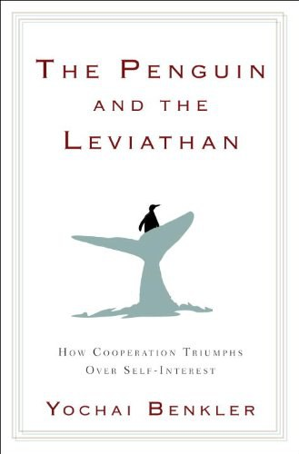

##  书名

《企鹅与利维坦：合作如何战胜私利》

英文原名：《The Penguin and the Leviathan：The Triumph of Cooperation Over Self-Interest》

## 封面

## 内容简介

“企鹅”寓意开放、分享、合作；而怪兽“利维坦”则代表了自私的人性观。本科勒教授利用神经系统科学、经济学、社会学、进化生物学、政治学中的最新发现，以及现实世界中的众多例子，揭示了人类的本能中，已经蕴藏着“合作”的基因。我们只需要换一种思维方式，重新设计制度和工具，“合作”的本能就能够驱动人类创造更大的价值。

人类并非是经济学家所想像的那种无可救药的自私自利的人和社会逆行者，而是具有与生俱来的合作本性，可以在各自同意的社会结构中携手行动。利用合作的力量，人类可以改善业务流程，设计更好的工艺，改革我们的经济体制，最大限度地发挥志愿者对科学的贡献，减少犯罪，提高市民运动的效力，等等。

## 作者简介

尤查•本科勒（Yochai Benkler）

* 哈佛大学法学教授，哈佛大学伯克曼互联网与社会中心主任，TED演讲人，圣塔菲研究所公开演讲人，跨学科研究的先锋。

* 互联时代知识传播、知识产权研究领域颇有建树的权威。2012年获牛津大学互联网学院“终身成就奖”，2011年获福特基金会“远见奖”，2007年获电子前哨基金会“先锋奖”，2006年获得非营利性组织“公共知识”（Public Knowledge ）颁发的IP3奖。

* 知识共享理念的推动者，他的著作《网络财富》就是“知识共享”版权许可的。“知识共享”运动发起人劳伦斯•莱斯格称他为“信息时代最了不起的天才”。

## 推荐理由

人与人合作，有很多种方式，但是开源的方式绝对是全新的，这不符合过去几千几万年人类的合作史，而且是超大规模的合作，因为这涉及到人性、信任、制度、财产分配。本书尝试解答这些难题。

## 推荐人

[适兕](https://opensourceway.community/all_about_kuosi)，作者，「开源之道」主创。「OSCAR·开源之书·共读」发起者和记录者。