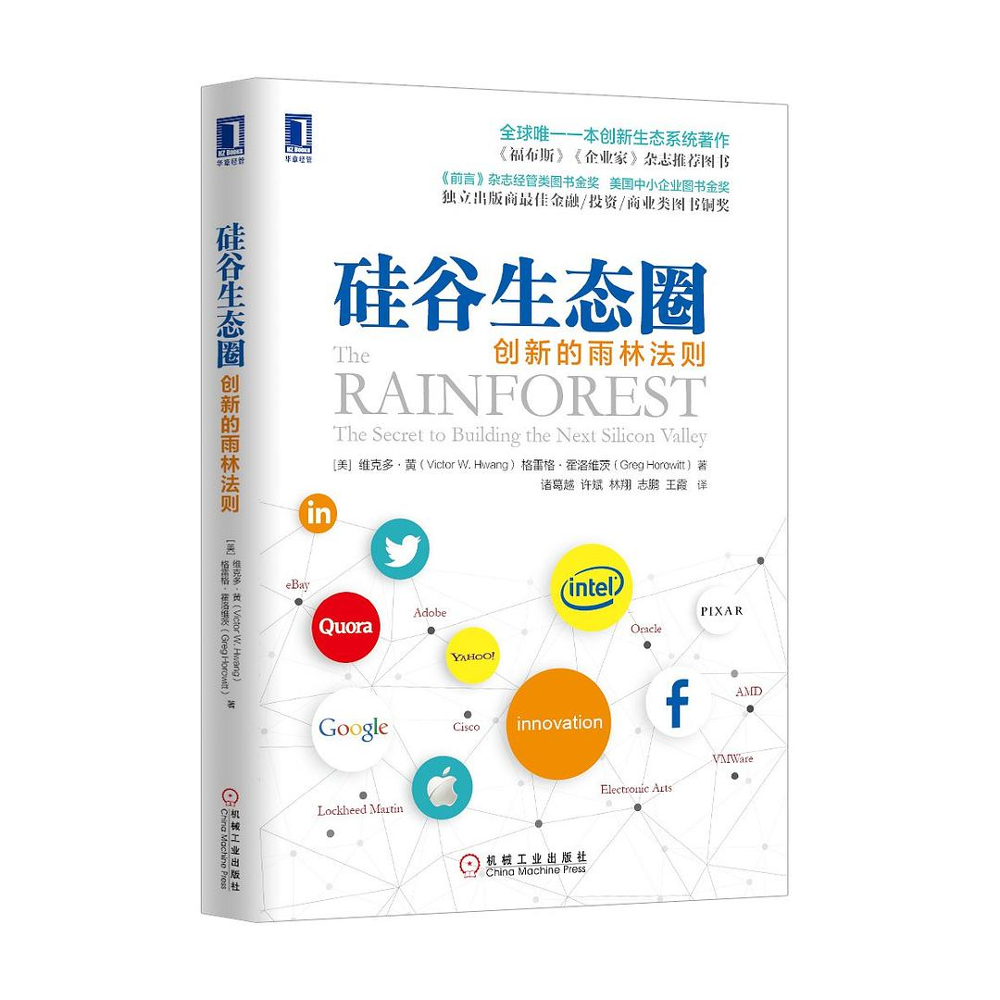

##  书名

《硅谷生态圈：创新的雨林法则》

英文原名：《The Rainforest：The Secret to Building the Next Silicon Valley》

## 封面

## 内容简介

* 是什么让硅谷这样的地方充满了创新的气氛？
* 人们可以在世界上的其它地方复制硅谷吗？
* 作为个体，我们又该如何在自己的网络中进行创新？

这本书会告诉你答案。

## 作者简介

Victor W. Hwang 和 Greg Horowitt 是总部位于硅谷的风险投资家和企业家。他们是 T2 Venture Capital 的联合创始人和董事总经理，该公司致力于发展初创企业、投资资本并协助全球创新经济的发展。

## 推荐理由

人类社会下的进步与创新，是环环相扣，非常和大自然几亿年形成的生物系统相似。开源的世界能够运转，也是有很多因素的，哪一个做的不到位，就不会走远。

## 推荐人

[适兕](https://opensourceway.community/all_about_kuosi)，作者，「开源之道」主创。「OSCAR·开源之书·共读」发起者和记录者。